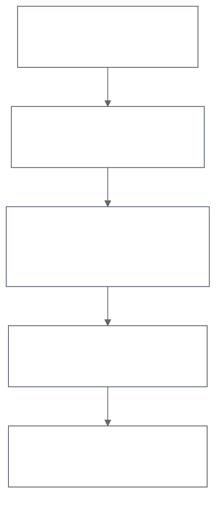

# Harombe Architecture

> **Orchestrate AI across your hardware**

Harombe is designed as a five-layer system that abstracts hardware complexity and provides a unified interface for distributed AI inference.

## Design Philosophy

**The Problem:** Running AI assistants across heterogeneous hardware (Apple Silicon, NVIDIA, AMD, CPU) is complex. Each device has different capabilities, but manually routing queries and managing workloads is error-prone.

**The Solution:** Harombe provides a declarative, YAML-based configuration that automatically:
- Detects available hardware
- Routes queries to appropriate nodes based on complexity
- Monitors health and performance
- Handles failures gracefully

Think of it as infrastructure-as-code for your personal AI cluster.

---

## System Layers



**Details:**
- **Layer 5 (Interface):** CLI commands, REST API with SSE streaming, health checks
- **Layer 4 (Agent):** ReAct agent loop, tool registry and execution, conversation state
- **Layer 3 (Coordination):** Cluster manager, smart routing, health monitoring, metrics, circuit breakers, mDNS discovery
- **Layer 2 (Inference):** LLM client protocol, Ollama backend, remote client, extensible for vLLM/llama.cpp
- **Layer 1 (Hardware):** Auto-detection (Apple Silicon, NVIDIA, AMD, CPU), VRAM-based recommendations

---

## Layer 1: Hardware Abstraction

**Purpose:** Detect available compute and recommend appropriate models.

**Components:**
- `hardware/detect.py` - GPU/VRAM detection for all major platforms
- `config/defaults.py` - Model selection table based on VRAM

**How it works:**
1. Detects GPU type and VRAM
2. Applies 85% safety margin (leave headroom for OS)
3. Recommends largest model that fits (Qwen 3 family by default)
4. Falls back to CPU if no GPU found

**Example:** 16GB M2 Mac → recommends `qwen3:8b` (needs ~5GB)

---

## Layer 2: Inference Abstraction

**Purpose:** Provide a unified interface to multiple LLM backends.

**Key Insight:** Use OpenAI SDK (not Ollama's Python package) because:
- Works with any OpenAI-compatible endpoint
- Makes it easy to add vLLM, llama.cpp, or cloud providers later
- Consistent tool calling API

**Components:**
- `llm/client.py` - Protocol defining `complete()` method
- `llm/ollama.py` - Ollama backend via `/v1` endpoint
- `llm/remote.py` - HTTP client for remote harombe nodes

**Interface:**
```python
async def complete(
    messages: List[Message],
    tools: Optional[List[ToolSchema]] = None,
    temperature: float = 0.7,
) -> CompletionResponse
```

---

## Layer 3: Coordination (Multi-Machine)

**Purpose:** Orchestrate distributed inference across heterogeneous nodes.

**This is Harombe's core innovation.** No other open source project combines:
- Hardware-agnostic clustering
- Smart routing based on query complexity
- Declarative YAML configuration
- Zero-cost failure handling (circuit breakers)

### Components

#### Cluster Manager (`coordination/cluster.py`)
- Node registry with health tracking
- Tier-based selection (user-defined, not hardware-specific)
- Load balancing across same-tier nodes
- Graceful fallback when preferred tier unavailable

#### Smart Router (`coordination/router.py`)
- Complexity classifier (simple/medium/complex)
- Analyzes query length, keywords, conversation context
- Routes to appropriate tier automatically
- Reasons about routing decisions (explainable)

#### Circuit Breaker (`coordination/circuit_breaker.py`)
- Prevents cascading failures
- Three states: Closed (healthy), Open (failing), Half-Open (testing)
- Exponential backoff with configurable thresholds

#### Metrics Collector (`coordination/metrics.py`)
- Tracks latency, throughput, success rates per node
- Cluster-wide aggregation
- Error history with circular buffer
- REST API endpoint (`/metrics`) and CLI (`harombe cluster metrics`)

#### Service Discovery (`coordination/discovery.py`)
- mDNS for local network auto-discovery
- Finds `_harombe._tcp.local` services
- Auto-registers discovered nodes

### Cluster Configuration

```yaml
cluster:
  routing:
    prefer_local: true          # Minimize latency
    fallback_strategy: graceful # Try other tiers if unavailable
    load_balance: true          # Distribute across same-tier nodes

  nodes:
    - name: laptop
      host: localhost
      port: 8000
      model: qwen2.5:3b
      tier: 0  # Fast/local

    - name: workstation
      host: 192.168.1.100
      port: 8000
      model: qwen2.5:14b
      tier: 1  # Balanced

    - name: server
      host: server.local
      port: 8000
      model: qwen2.5:72b
      tier: 2  # Powerful
```

**Tiers are user-controlled**, not hardware-determined. You decide what counts as "fast", "medium", or "powerful" based on your needs.

### Routing Example

**Query:** "What's the weather?"
- **Classification:** Simple (short, no context, common query)
- **Recommended Tier:** 0 (fast/local)
- **Selected Node:** `laptop` (lowest latency)

**Query:** "Refactor this Python code to use async/await, explain the benefits, and write unit tests"
- **Classification:** Complex (long, multiple steps, code generation)
- **Recommended Tier:** 2 (powerful)
- **Selected Node:** `server` (largest model)

---

## Layer 4: Agent & Memory

**Purpose:** Autonomous task execution with tool use.

**Pattern:** ReAct (Reasoning + Acting) loop

### Agent Loop (`agent/loop.py`)

```python
while steps < max_steps:
    response = llm.complete(messages, tools)

    if no tool_calls:
        return response  # Done

    for tool_call in response.tool_calls:
        if dangerous and confirm_required:
            if user_declines:
                result = "[CANCELLED]"
            else:
                result = await tool.execute()
        else:
            result = await tool.execute()

        messages.append(tool_result)
```

**Safety:** Dangerous tools (shell, filesystem writes) require user confirmation by default.

### Tool System (`tools/`)

Tools are registered via decorator:

```python
@tool(description="Execute a shell command", dangerous=True)
async def shell(command: str, timeout: int = 30) -> str:
    """Run a shell command.

    Args:
        command: The shell command to execute
        timeout: Max execution time in seconds
    """
    # Implementation
```

The decorator:
- Introspects type hints → generates JSON Schema
- Registers in global registry
- Marks dangerous operations

**Built-in Tools:**
- `shell` - Execute commands (dangerous)
- `read_file` / `write_file` - Filesystem operations
- `web_search` - DuckDuckGo search (no API key required)

**Extensibility:** Easy to add custom tools following the same pattern.

### Memory (Phase 2)

Future additions:
- Long-term conversation memory
- Vector store integration (e.g., Qdrant)
- Knowledge base management
- Privacy router for PII detection

---

## Layer 5: User Interface

**Purpose:** Multiple interfaces to the same underlying system.

### CLI (`cli/`)

**Commands:**
- `harombe init` - Hardware detection + config generation
- `harombe chat` - Interactive REPL with Rich formatting
- `harombe start/stop/status` - Server lifecycle
- `harombe doctor` - System diagnostics
- `harombe cluster init/status/test/metrics` - Cluster management

**Example:**
```bash
$ harombe cluster status
┏━━━━━━━━━━━━┳━━━━━━━━━━━━━━━━━━━┳━━━━━━┳━━━━━━━━━━━━━┳━━━━━━━━━━━┳━━━━━━━━━┓
┃ Name       ┃ Host              ┃ Tier ┃ Model       ┃ Status    ┃ Latency ┃
┡━━━━━━━━━━━━╇━━━━━━━━━━━━━━━━━━━╇━━━━━━╇━━━━━━━━━━━━━╇━━━━━━━━━━━╇━━━━━━━━━┩
│ laptop     │ localhost:8000    │ 0    │ qwen2.5:3b  │ available │ 2.3ms   │
│ server     │ server.local:8000 │ 2    │ qwen2.5:72b │ available │ 15.7ms  │
└────────────┴───────────────────┴──────┴─────────────┴───────────┴─────────┘
```

### REST API (`server/`)

**Endpoints:**
- `GET /health` - Health check with model info
- `POST /chat` - Non-streaming chat
- `POST /chat/stream` - SSE streaming
- `POST /api/complete` - LLM proxy (for RemoteLLMClient)
- `GET /metrics` - Performance metrics

**Why both CLI and API?**
- CLI for interactive use, exploration, debugging
- API for integrations, automation, building on top

---

## Configuration Philosophy

**Zero-config works, but customization is easy.**

Default behavior:
1. Auto-detect hardware
2. Recommend model
3. Use sane defaults for everything
4. `harombe chat` just works

But if you want control:
```yaml
model:
  name: qwen2.5:7b
  temperature: 0.7
  context_length: 8192

agent:
  max_steps: 10
  system_prompt: "Custom instructions..."

tools:
  shell: true
  filesystem: true
  web_search: true
  confirm_dangerous: true

cluster:
  nodes: [...]
```

**Validation:** Pydantic ensures type safety and provides helpful errors.

---

## Design Decisions

### Why Ollama?
- Easiest local inference (one command: `ollama pull`)
- Supports all major hardware (Metal, CUDA, ROCm, CPU)
- OpenAI-compatible API
- Active community

But we're not locked in - Layer 2 abstraction makes it easy to add other backends.

### Why OpenAI SDK (not Ollama Python package)?
- Works with any OpenAI-compatible endpoint
- Consistent tool calling interface
- Future-proof: can point at vLLM, llama.cpp, cloud providers

### Why YAML (not TOML)?
- Better for nested structures (cluster config)
- Comments for documentation
- More familiar to infrastructure engineers

### Why Tiers (not automatic hardware classification)?
You know your workloads better than we do. A 14B model on a fast GPU might be "tier 1", but a 72B model on a slow GPU might also be "tier 1" for your use case.

**User-controlled tiers = flexibility.**

### Why ReAct (not other agent patterns)?
- Simple (~300 LOC)
- Explainable (see reasoning)
- Works well for tool use
- Easy to debug

---

## Performance Characteristics

**Single-machine mode:**
- Latency: First token in ~100-500ms (depends on model)
- Throughput: Varies by hardware (M2 Pro: ~30 tokens/sec for 7B model)

**Cluster mode:**
- Network overhead: +10-50ms per hop
- Smart routing minimizes unnecessary network calls
- Load balancing improves overall throughput
- Circuit breakers prevent cascading failures

**Metrics example (3-node cluster):**
```
Cluster Summary
  Total Requests:      1,247
  Average Success:     98.3%
  Average Latency:     87.4ms
  Cluster Throughput:  894 tokens/sec
```

---

## Failure Modes & Recovery

### Node Failure
1. Circuit breaker detects repeated failures
2. Opens circuit (stops sending traffic)
3. Fallback strategy routes to other tiers
4. Periodic health checks test recovery
5. Half-open state validates before full reopen

### Network Partition
- Prefer local nodes (minimize network dependency)
- Graceful degradation (single-machine mode still works)
- No distributed consensus required (coordinator is authoritative)

### Model Errors
- Retry with exponential backoff
- Tool execution failures logged but don't crash agent
- Max steps prevents infinite loops

---

## Future Roadmap

### Phase 2: Memory & Privacy
- Long-term conversation memory
- Vector store for semantic search
- Privacy router (detect PII, route sensitive queries locally)
- Knowledge base management

### Phase 3: Advanced Features
- Voice I/O (STT/TTS)
- Web UI with real-time updates
- Plugin system for custom tools
- Multi-modal support (vision, audio)

### Potential Additions
- Speculative decoding across nodes
- Model ensembles (multiple nodes vote)
- Fine-tuning workflow integration
- Observability dashboard (Grafana-style)

---

## Code Organization

```
src/harombe/
├── __init__.py
├── __main__.py
├── cli/              # Layer 5: User interface
│   ├── app.py
│   ├── chat.py
│   ├── cluster_cmd.py
│   └── init_cmd.py
├── agent/            # Layer 4: Agent loop
│   └── loop.py
├── coordination/     # Layer 3: Multi-machine
│   ├── cluster.py
│   ├── router.py
│   ├── circuit_breaker.py
│   ├── metrics.py
│   └── discovery.py
├── llm/              # Layer 2: Inference abstraction
│   ├── client.py
│   ├── ollama.py
│   └── remote.py
├── hardware/         # Layer 1: Hardware detection
│   └── detect.py
├── tools/            # Tool system
│   ├── base.py
│   ├── registry.py
│   ├── shell.py
│   ├── filesystem.py
│   └── web_search.py
├── config/           # Configuration
│   ├── schema.py
│   ├── loader.py
│   └── defaults.py
└── server/           # REST API
    ├── app.py
    └── routes.py
```

**Design principle:** Each layer only depends on layers below it. No circular dependencies.

---

## Testing Strategy

**Unit tests:** Mock LLM responses, no Ollama required
- `tests/test_agent.py` - Agent loop with mocked LLM
- `tests/test_tools.py` - Tool registration and execution
- `tests/test_metrics.py` - Metrics collection (99% coverage)

**Integration tests:** Require running Ollama (marked as skipped by default)
- `tests/test_server.py` - Full API tests
- `tests/test_cli.py` - CLI commands

**Coverage:** 51% overall (core logic well-covered, CLI commands less so)

Run tests:
```bash
pytest                    # All tests (2 skipped)
pytest -v                # Verbose
pytest --cov             # With coverage report
```

---

## Contributing

See [CONTRIBUTING.md](docs/CONTRIBUTING.md) for development setup and guidelines.

**Key areas for contribution:**
1. Additional LLM backends (vLLM, llama.cpp)
2. More built-in tools
3. Web UI
4. Documentation improvements
5. Performance optimizations

---

## FAQ

**Q: Why not use Ray, Kubernetes, etc?**

A: Those are designed for production cloud deployments. Harombe targets enthusiasts running a mix of consumer hardware (laptops, desktops, old GPUs). We prioritize:
- Zero-config setup
- Declarative YAML (not code)
- Privacy (no cloud required)

**Q: How is this different from Ollama alone?**

A: Ollama is single-machine inference. Harombe adds:
- Multi-machine orchestration
- Smart routing based on query complexity
- Agent loop with tool use
- Declarative cluster management

**Q: Can I use cloud GPUs?**

A: Yes! Just add them as nodes with appropriate tier. Works with any machine running harombe in server mode.

**Q: What about costs?**

A: Hardware only. No API keys, no usage-based pricing. Your electricity bill is your only cost.

**Q: Is this production-ready?**

A: Phase 1 (multi-machine orchestration) is complete and stable. It's suitable for personal use and experimentation. For production, you'd want:
- Authentication/authorization
- More robust error handling
- Monitoring/alerting
- SLA guarantees

---

## License

Apache 2.0 - see [LICENSE](LICENSE)

Built by [Small Thinking Machines](https://github.com/smallthinkingmachines)
