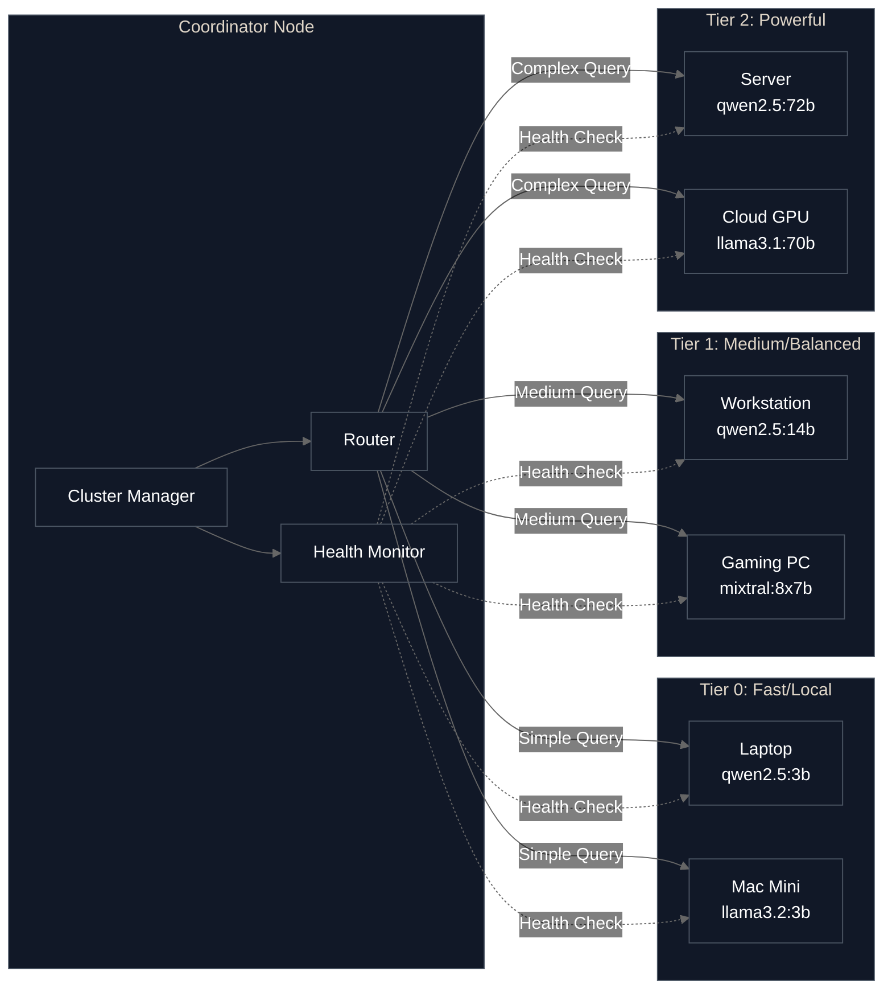

# harombe

> **Self-hosted agent framework for distributed AI**

Build autonomous AI agents that orchestrate workloads across your hardware—one machine or many—with zero cloud dependencies.

## Table of Contents

- [What is harombe?](#what-is-harombe)
- [Usage Patterns](#usage-patterns)
- [Architecture](#architecture)
- [Current Status](#current-status)
- [Quick Start](#quick-start)
- [Examples](#examples)
- [Usage](#usage)
- [Configuration](#configuration)
- [Multi-Machine Clusters](#multi-machine-clusters-experimental)
- [How It Works](#how-it-works)
- [Roadmap](#roadmap)
- [Troubleshooting](#troubleshooting)
- [Development](#development)
- [Contributing](#contributing)

## What is harombe?

**harombe** is a general-purpose agent framework that orchestrates heterogeneous consumer hardware (Apple Silicon, NVIDIA, AMD, CPU) into a unified system for autonomous task execution. Define your cluster in YAML, create custom tools, and let harombe route workloads to the right hardware based on task complexity.

**The gap harombe fills:** No other open source project combines distributed inference across mixed hardware, autonomous agent loops with tool execution, and declarative cluster configuration. Existing solutions require either cloud providers, single-machine constraints, or complex DevOps expertise.

**Core capabilities:**

- **Autonomous execution:** Agents that plan, use tools, and execute multi-step tasks
- **Distributed orchestration:** Smart routing across heterogeneous hardware based on workload complexity
- **Privacy-first:** Your data, models, and workloads never leave your infrastructure
- **Extensible:** Add custom tools, backends, nodes, and agent behaviors
- **Observable:** Built-in metrics, health monitoring, circuit breakers, and failure recovery
- **Zero-config start:** `pip install harombe && harombe init && harombe chat` works in <5 minutes

**Use cases:**

- Interactive AI assistants with tool use (chat, voice)
- Automated data processing pipelines
- Code generation and analysis workflows
- Research automation with web search and file management
- Multi-modal agents (vision, audio - roadmap)

> **⚠️ Security Notice**
>
> harombe can execute shell commands and modify files. While dangerous operations require confirmation by default:
>
> - Review what the AI plans to do before approving
> - Run in sandboxed environments (Docker, VMs) when testing
> - Keep `confirm_dangerous: true` in your configuration
>
> **Security Layer (Phase 4.1-4.6 Complete):** Core security infrastructure is now implemented:
>
> - ✅ MCP Gateway with containerized tool isolation
> - ✅ Comprehensive audit logging with SQLite
> - ✅ Secret management (HashiCorp Vault, SOPS, env vars)
> - ✅ Per-container network egress filtering
> - ✅ Human-in-the-Loop (HITL) approval gates with risk classification
> - ✅ Browser container with pre-authentication and accessibility-based interaction
> - ⏳ Code execution sandbox (Phase 4.7-4.8)
>
> See [SECURITY.md](SECURITY.md) and [docs/security-quickstart.md](docs/security-quickstart.md) for detailed security guidance.

## Usage Patterns

harombe supports two approaches for working with AI agents:

### Library Approach (Current)

Use harombe as a Python library to programmatically create and control agents. This gives you maximum flexibility to integrate AI capabilities into your existing applications.

```python
from harombe.agent.loop import Agent
from harombe.llm.ollama import OllamaClient
from harombe.tools.registry import get_enabled_tools

# Create an agent programmatically
llm = OllamaClient(model="qwen2.5:7b")
tools = get_enabled_tools(shell=True, filesystem=True, web_search=True)
agent = Agent(llm=llm, tools=tools, system_prompt="You are a helpful assistant.")

# Use it in your code
response = await agent.run("Analyze this dataset")
```

**When to use:**

- Building custom applications with AI capabilities
- Need fine-grained control over agent behavior
- Integrating with existing Python codebases
- Dynamic agent creation based on runtime conditions

### Platform Approach (Future)

Define agents declaratively in YAML configuration, and let harombe create and manage them for you. This makes it easy to deploy pre-configured agents without writing code.

```yaml
# Future: harombe.yaml
agents:
  - name: research-agent
    system_prompt: "You are a research assistant."
    tools: [web_search, filesystem]
    model: qwen2.5:7b

  - name: sysadmin-agent
    system_prompt: "You are a system administrator."
    tools: [shell, filesystem]
    model: qwen2.5:14b
```

**When to use (planned):**

- Deploying standardized agents across your infrastructure
- Configuration-driven workflows
- Quick agent setup without coding
- Team environments with shared agent configurations

**Current status:** The platform approach with declarative agent configuration is planned for a future phase. For now, use the library approach shown in the [examples](examples/) directory.

## Architecture

harombe is a six-layer system designed for clarity, security, and extensibility:

```
┌─────────────────────────────────────┐
│  Layer 6: Clients                   │  Voice, iOS, Web, CLI
├─────────────────────────────────────┤
│  Layer 5: Privacy Router        ✅  │  Hybrid local/cloud AI
│  PII detection, context sanitizer   │  local-only / hybrid / cloud
├─────────────────────────────────────┤
│  Layer 4: Agent & Memory        ✅  │  ReAct loop, tools, memory
├─────────────────────────────────────┤
│  Layer 3: Security              ✅  │  Defense-in-depth complete
│  MCP Gateway, container isolation   │  Credential vault, audit log
│  Per-tool egress, secret scanning   │  HITL gates, browser pre-auth
│  Code execution sandbox (gVisor)    │  Anomaly detection, SIEM
├─────────────────────────────────────┤
│  Layer 2: Orchestration         ✅  │  Smart routing, health monitoring
│  Cluster config, mDNS discovery     │  Circuit breakers, metrics
├─────────────────────────────────────┤
│  Layer 1: Runtimes              ✅  │  llama.cpp, Whisper, TTS, embeddings
└─────────────────────────────────────┘
```

**Layer 3: Security** — Harombe's security layer is complete (Phase 4-6), providing container isolation, credential management, audit logging, network egress filtering, anomaly detection, and SIEM integration. Key finding from security research (Feb 2026): **MCP cannot enforce security at the protocol level** — all security must be enforced at the infrastructure layer (containers, network policies, gateways). See [docs/security-quickstart.md](docs/security-quickstart.md) for setup instructions.

See [ARCHITECTURE.md](ARCHITECTURE.md) for detailed design documentation.

## Current Status

**Phase 0 (Complete):** Single-machine agent foundation

- Tool execution system (shell, filesystem, web search)
- ReAct agent loop with autonomous reasoning
- Hardware auto-detection and model selection
- Interactive CLI and REST API
- Zero-config deployment

**Phase 1 (Complete):** Multi-machine orchestration

- Cluster configuration and node management
- Smart routing based on task complexity
- Health monitoring with circuit breakers
- Performance metrics and observability
- mDNS service discovery

**Phase 2.1 (Complete):** Conversation Memory

- SQLite-based conversation persistence
- Session management and lifecycle
- Token-based context windowing
- Multi-turn conversations with history recall
- Optional memory (backward compatible)

**Phase 2.2 (Complete):** Semantic Search & RAG

- Vector embeddings with sentence-transformers (privacy-first, local)
- ChromaDB vector store for similarity search
- Semantic search across conversation history
- RAG (Retrieval-Augmented Generation) for context-aware responses
- Cross-session knowledge retrieval

**Phase 3 (Complete):** Voice & Multi-Modal

- Speech-to-text with Whisper (tiny to large-v3 models)
- Text-to-speech with Piper (fast, all Python versions) and Coqui (high-quality, Python <3.11 only)
- Push-to-talk voice interface (press SPACE to record)
- Voice API endpoints (REST + WebSocket streaming)
- Real-time audio processing with sounddevice
- Cross-platform audio I/O (macOS, Linux, Windows)

**Phase 4 (Foundation Complete):** Security Layer

Core security infrastructure implemented (Phase 4.1-4.6):

- **MCP Protocol & Gateway** - JSON-RPC 2.0 protocol base, containerized MCP Gateway server
- **Audit Logging** - SQLite-based comprehensive audit trail with sensitive data redaction
- **Secret Management** - HashiCorp Vault, SOPS, and environment variable backends
- **Network Isolation** - Per-container egress filtering with Docker networks and iptables
- **Human-in-the-Loop Gates** - Risk-based approval workflows with CLI/API prompts
- **Browser Container** - Pre-authenticated browser automation with accessibility-based interaction

Remaining work (Phase 4.7-4.8):

- Code execution sandbox with gVisor
- End-to-end security integration and testing

See [docs/security-quickstart.md](docs/security-quickstart.md) for setup instructions.

## Quick Start

### Prerequisites

- Python 3.11+
- [Ollama](https://ollama.ai) installed and running

### Installation

```bash
# Install harombe
pip install harombe

# Initialize configuration (detects your hardware)
harombe init

# Pull recommended model
ollama pull qwen2.5:7b  # or whatever model was recommended

# Start interactive agent
harombe chat
```

That's it! You have a working autonomous agent in under 5 minutes.

**Example multi-step task:**

```
You: Find all Python files in this directory that import 'requests',
     check which ones don't have error handling, and create a summary report.

Agent: I'll help you analyze Python files for requests usage and error handling.
       [Executing: find . -name "*.py"]
       [Executing: grep -l "import requests" on each file]
       [Reading files and analyzing error handling patterns]
       [Writing summary to requests_analysis.md]

       Done! I found 12 files using requests. 5 of them lack try-except blocks
       around HTTP calls. Summary saved to requests_analysis.md
```

The agent autonomously plans the workflow, executes tools, and delivers results.

### Voice Assistant

Enable voice interaction with speech-to-text and text-to-speech:

```bash
# Start voice assistant (push-to-talk mode)
harombe voice

# Press and hold SPACE to record
# Release SPACE to process speech
# The agent responds with voice output
```

**Hardware Requirements:**

- Microphone for audio input
- Speakers/headphones for audio output
- Recommended: 4GB+ VRAM for Whisper medium model
- Minimum: 2GB VRAM for Whisper base model

**Configuration** (edit `harombe.yaml`):

```yaml
voice:
  enabled: true
  stt:
    model: base # tiny, base, small, medium, large-v3
    language: null # Auto-detect, or specify: en, es, fr, etc.
  tts:
    engine: piper # piper (fast, all Python) or coqui (high-quality, Python <3.11)
    model: en_US-lessac-medium
    speed: 1.0
```

See [`harombe.yaml.example`](harombe.yaml.example) for full configuration options and [`examples/09_voice_assistant.py`](examples/09_voice_assistant.py) for programmatic usage.

## Examples

See [`examples/`](examples/) for working code demonstrating:

- **01_simple_agent.py** - Basic single-node usage with all tools
- **02_api_usage.py** - Programmatic agent creation and tool usage
- **03_data_pipeline.py** - Data processing pipeline with autonomous agents
- **04_code_review.py** - Automated code review workflows
- **05_research_agent.py** - Research automation with web search
- **06_memory_conversation.py** - Persistent conversation history
- **07_cluster_routing.py** - Task-based routing across heterogeneous nodes
- **08_semantic_memory.py** - Semantic search and RAG capabilities
- **09_voice_assistant.py** - Voice-enabled AI assistant (STT + TTS)

Each example includes detailed comments and can be run standalone.

## Usage

harombe provides both CLI commands (platform mode) and a Python library (library mode).

### Interactive Agent Interface (CLI)

```bash
harombe chat
```

The `harombe chat` command creates and manages an agent for you based on your configuration. The agent will:

- Reason about tasks and break them into steps
- Execute tools as needed (shell commands, file operations, web search)
- Handle multi-step workflows autonomously
- Ask for confirmation before dangerous operations

Commands:

- `/help` - Show available commands
- `/model` - Show current model info
- `/tools` - List enabled tools
- `/exit` - Exit interface

### REST API (CLI)

```bash
# Start API server
harombe start

# Health check
curl http://localhost:8000/health

# Submit task to agent
curl -X POST http://localhost:8000/chat \
  -H "Content-Type: application/json" \
  -d '{"message": "Analyze the last 100 lines of system.log and summarize errors"}'
```

The REST API provides programmatic access to the agent system for integration with other tools, automation pipelines, or custom interfaces.

### Python Library

For deeper integration, use harombe as a Python library in your code. See [`examples/02_api_usage.py`](examples/02_api_usage.py) for comprehensive examples:

```python
from harombe.agent.loop import Agent
from harombe.llm.ollama import OllamaClient
from harombe.tools.registry import get_enabled_tools

llm = OllamaClient(model="qwen2.5:7b")
tools = get_enabled_tools(shell=True, filesystem=True, web_search=True)
agent = Agent(llm=llm, tools=tools, system_prompt="You are a helpful assistant.")

response = await agent.run("Your task here")
```

This gives you full control over agent creation, configuration, and behavior.

### Conversation Memory

harombe supports persistent conversation history across agent interactions. This allows agents to remember context from previous messages and maintain continuity across multiple runs.

**Enable memory in your config:**

```yaml
memory:
  enabled: true
  storage_path: ~/.harombe/memory.db
  max_history_tokens: 4096
```

**Use memory programmatically:**

```python
from harombe.agent.loop import Agent
from harombe.llm.ollama import OllamaClient
from harombe.memory.manager import MemoryManager

# Create memory manager
memory = MemoryManager(
    storage_path="~/.harombe/memory.db",
    max_history_tokens=4096,
)

# Create or get session
session_id, created = memory.get_or_create_session(
    session_id="my-conversation",
    system_prompt="You are a helpful assistant.",
)

# Agent automatically loads history
llm = OllamaClient(model="qwen2.5:7b")
agent = Agent(
    llm=llm,
    tools=tools,
    memory_manager=memory,
    session_id=session_id,
)

# First message
await agent.run("What is your name?")

# Later: new agent instance remembers previous context
agent2 = Agent(llm=llm, tools=tools, memory_manager=memory, session_id=session_id)
await agent2.run("Do you remember what I asked before?")  # Agent recalls previous messages
```

**Key features:**

- **Automatic history loading** - Agent loads conversation context on startup
- **Token windowing** - Most recent messages that fit within token limit
- **Session management** - Multiple independent conversations
- **Backward compatible** - Memory is optional, existing code works unchanged

See [`examples/06_memory_conversation.py`](examples/06_memory_conversation.py) for a complete demonstration.

### Semantic Search & RAG

harombe supports semantic search over conversation history using vector embeddings, enabling agents to retrieve relevant context from past conversations even when the exact wording is different. This powers Retrieval-Augmented Generation (RAG) for smarter, context-aware responses.

**Enable semantic search and RAG:**

```yaml
memory:
  enabled: true
  storage_path: ~/.harombe/memory.db
  max_history_tokens: 4096
  vector_store:
    enabled: true
    backend: chromadb
    embedding_model: sentence-transformers/all-MiniLM-L6-v2
    embedding_provider: sentence-transformers # Local, privacy-first
    persist_directory: ~/.harombe/vectors
  rag:
    enabled: true
    top_k: 5
    min_similarity: 0.7
```

**Use RAG programmatically:**

```python
from harombe.agent.loop import Agent
from harombe.llm.ollama import OllamaClient
from harombe.memory.manager import MemoryManager
from harombe.embeddings.sentence_transformer import SentenceTransformerEmbedding
from harombe.vector.chromadb import ChromaDBVectorStore

# Setup semantic search
embedding_client = SentenceTransformerEmbedding(
    model_name="sentence-transformers/all-MiniLM-L6-v2",
    device="cpu",  # or "cuda" for GPU
)

vector_store = ChromaDBVectorStore(
    collection_name="harombe_embeddings",
    persist_directory="~/.harombe/vectors",
)

# Create memory manager with semantic search
memory = MemoryManager(
    storage_path="~/.harombe/memory.db",
    max_history_tokens=4096,
    embedding_client=embedding_client,
    vector_store=vector_store,
)

# Create RAG-enabled agent
session_id = memory.create_session(system_prompt="You are a helpful assistant.")
agent = Agent(
    llm=OllamaClient(model="qwen2.5:7b"),
    tools=tools,
    memory_manager=memory,
    session_id=session_id,
    enable_rag=True,        # Enable RAG
    rag_top_k=5,            # Retrieve 5 similar messages
    rag_min_similarity=0.7, # Minimum similarity threshold
)

# Agent will automatically retrieve relevant context
await agent.run("What did we discuss about Python?")
# The agent retrieves semantically similar messages even if
# the exact word "Python" wasn't in the original query
```

**Search conversation history:**

```python
# Search for similar messages across all conversations
results = await memory.search_similar(
    query="machine learning and neural networks",
    top_k=5,
    min_similarity=0.7,
)

for msg in results:
    print(f"[{msg.role}]: {msg.content}")

# Search within a specific session
results = await memory.search_similar(
    query="Python programming",
    top_k=3,
    session_id="my-session",
    min_similarity=0.6,
)
```

**Key features:**

- **Privacy-first** - Embeddings run locally using sentence-transformers, no API calls
- **Semantic understanding** - Find relevant context even with different wording
- **Cross-session search** - Retrieve knowledge from any past conversation
- **RAG integration** - Agents automatically inject relevant context into queries
- **Backward compatible** - Semantic search is optional, works with or without it

**How it works:**

1. Messages are automatically embedded as they're saved (384-dimensional vectors)
2. Embeddings are stored in ChromaDB for fast similarity search
3. When RAG is enabled, agent retrieves similar messages before generating responses
4. Relevant context is injected into the prompt for better, more informed answers

See [`examples/08_semantic_memory.py`](examples/08_semantic_memory.py) for comprehensive examples including backfilling embeddings for existing conversations.

### Configuration

Configuration is stored at `~/.harombe/harombe.yaml`. Here's an example:

```yaml
model:
  name: qwen2.5:7b
  quantization: Q4_K_M
  context_length: 8192
  temperature: 0.7

ollama:
  host: http://localhost:11434
  timeout: 120

agent:
  max_steps: 10
  system_prompt: "You are Harombe, a helpful AI assistant..."

tools:
  shell: true
  filesystem: true
  web_search: true
  confirm_dangerous: true

memory:
  enabled: false # Set to true to enable conversation persistence
  storage_path: ~/.harombe/memory.db
  max_history_tokens: 4096
  vector_store:
    enabled: false # Enable for semantic search
    backend: chromadb
    embedding_model: sentence-transformers/all-MiniLM-L6-v2
    embedding_provider: sentence-transformers
    persist_directory: ~/.harombe/vectors
  rag:
    enabled: false # Enable for context-aware responses
    top_k: 5
    min_similarity: 0.7

server:
  host: 127.0.0.1
  port: 8000
```

All fields have sensible defaults - you can run with an empty config file or no config at all!

### Multi-Machine Clusters (Experimental)

harombe can orchestrate inference across multiple machines with different hardware capabilities:

```bash
# Generate cluster configuration template
harombe cluster init

# Check cluster status
harombe cluster status

# Test connectivity to all nodes
harombe cluster test
```

Example cluster configuration:

```yaml
cluster:
  coordinator:
    host: localhost

  routing:
    prefer_local: true # Prefer lowest latency nodes
    fallback_strategy: graceful # Try other tiers if preferred unavailable
    load_balance: true # Distribute across same-tier nodes

  nodes:
    # Fast/local node for simple queries
    - name: laptop
      host: localhost
      port: 8000
      model: qwen2.5:3b
      tier: 0

    # Balanced node for medium workloads
    - name: workstation
      host: 192.168.1.100
      port: 8000
      model: qwen2.5:14b
      tier: 1

    # Powerful node for complex tasks
    - name: server
      host: server.local
      port: 8000
      model: qwen2.5:72b
      tier: 2
```

**Tiers are user-defined** - assign based on your judgment of hardware capabilities:

- **Tier 0** (fast): Low latency, simple queries
- **Tier 1** (medium): Balanced performance
- **Tier 2** (powerful): Complex queries, large context

Works with any hardware mix: Apple Silicon, NVIDIA, AMD, CPU, cloud instances.

#### Cluster Topology



#### Setting Up Multi-Machine Clusters

Each node in your cluster runs harombe in server mode. Here's how to set it up:

**On each node machine:**

1. Install harombe and dependencies:

```bash
# Install harombe
pip install harombe

# Ensure Ollama is running
ollama serve &

# Pull the model for this node
ollama pull qwen2.5:14b  # or whichever model this node will run
```

2. Create configuration file at `~/.harombe/harombe.yaml`:

```yaml
model:
  name: qwen2.5:14b # Model for this specific node

server:
  host: 0.0.0.0 # Listen on all interfaces
  port: 8000

ollama:
  host: http://localhost:11434
```

3. Start the harombe server:

```bash
harombe start
```

4. Verify it's accessible:

```bash
curl http://<node-ip>:8000/health
```

**On the coordinator machine:**

Add the cluster configuration to your `~/.harombe/harombe.yaml`:

```yaml
cluster:
  nodes:
    - name: workstation
      host: 192.168.1.100 # IP or hostname of the node
      port: 8000
      model: qwen2.5:14b
      tier: 1

    # Add more nodes...
```

Then check cluster status:

```bash
harombe cluster status
```

**Network Requirements:**

- All nodes must be network-accessible from the coordinator
- Port 8000 (or your configured port) must be open on each node
- For SSH-based deployments, consider using SSH tunneling for secure connections

## How It Works

### Single Machine

1. `harombe init` detects your hardware and recommends a model
2. `harombe chat` starts the agent loop locally
3. Queries are processed with tool calling (shell, files, web search)

### Cluster Mode

1. Define nodes in YAML (each machine runs `harombe start`)
2. Coordinator analyzes query complexity
3. Routes to appropriate tier (fast/local → tier 0, complex → tier 2)
4. Monitors health, handles failures with circuit breakers

**Visual Overview:**

See [ARCHITECTURE.md](ARCHITECTURE.md) for the full five-layer system design, component details, and design decisions.

## Roadmap

### Phase 0: Weekend MVP (Complete)

- Single-machine AI assistant with tool calling
- ReAct agent loop
- Hardware auto-detection
- Interactive CLI and REST API

### Phase 1: Multi-Machine Orchestration (Complete)

- **Phase 1.1** (Complete): Cluster foundation
  - Cluster configuration schema
  - Remote LLM client
  - Health monitoring and node selection
  - CLI commands for cluster management

- **Phase 1.2** (Complete): Discovery & Health
  - mDNS auto-discovery for local networks
  - Periodic health monitoring
  - Circuit breaker pattern
  - Retry logic with exponential backoff

- **Phase 1.3** (Complete): Smart Routing
  - Task complexity classification
  - Context-aware routing decisions
  - Automatic tier selection
  - Integration with agent loop

- **Phase 1.4** (Complete): Polish & Monitoring
  - Dynamic node management (add/remove nodes at runtime)
  - Performance metrics collection and tracking
  - REST API metrics endpoint
  - CLI metrics command

### Phase 2: Memory & Context (Complete)

- **Phase 2.1** (Complete): Conversation Memory
  - SQLite-based conversation persistence
  - Session management and lifecycle
  - Token-based context windowing
  - Multi-turn conversations with history recall
  - Optional memory (backward compatible)

- **Phase 2.2** (Complete): Semantic Search & RAG
  - Vector embeddings with sentence-transformers (privacy-first, local)
  - ChromaDB vector store for similarity search
  - Semantic search across conversation history
  - RAG (Retrieval-Augmented Generation) for context-aware responses
  - Cross-session knowledge retrieval

### Phase 3: Voice & Multi-Modal (Complete)

- ✅ Whisper STT integration (speech-to-text)
- ✅ TTS integration (Piper fast, Coqui high-quality)
- ✅ Voice client (push-to-talk)
- ✅ Voice API endpoints (REST + WebSocket)
- ✅ Real-time audio processing
- ✅ Cross-platform audio I/O (macOS, Linux, Windows)
- 🔮 Multi-modal support (vision - future phases)

### Phase 4: Security Layer (Foundation Complete)

**Phase 4.1-4.4 (Complete):** Core security infrastructure

- ✅ **MCP Protocol Base** - JSON-RPC 2.0 protocol implementation
- ✅ **Docker Container Manager** - Container lifecycle management with resource limits
- ✅ **MCP Gateway Server** - Centralized gateway for tool execution routing
- ✅ **Audit Logging System** - SQLite-based comprehensive audit trail
  - Event tracking (requests, responses, errors)
  - Tool call logging with parameters and results
  - Security decision logging
  - Sensitive data redaction (API keys, passwords, tokens)
- ✅ **Secret Management** - Multi-backend credential vault
  - HashiCorp Vault integration (production)
  - SOPS file encryption (small teams)
  - Environment variables (development)
  - Secret scanning and detection
  - Automatic secret injection into containers
- ✅ **Network Isolation** - Per-container egress filtering
  - Docker network isolation
  - iptables-based egress rules
  - Domain allowlists
  - DNS query filtering
  - Connection attempt logging

**Phase 4.5 (Complete):** Human-in-the-Loop Gates

- ✅ **Risk-Based Classification** - LOW/MEDIUM/HIGH/CRITICAL operation classification
- ✅ **HITL Gate System** - Centralized approval management with timeout handling
- ✅ **CLI Approval Prompts** - Rich console formatting with risk-level color coding
- ✅ **API Approval Support** - Web/API-compatible prompt data structures
- ✅ **Gateway Integration** - HITL checks before tool execution
- ✅ **Audit Integration** - All approval decisions logged to audit trail
- ✅ **Default-Deny Safety** - Auto-deny on timeout for security

**Phase 4.6 (Complete):** Browser Container with Pre-Authentication

- ✅ **Browser Container Manager** - Playwright-based browser automation with session isolation
- ✅ **Pre-Authentication Flow** - Credentials injected before agent access from vault backend
- ✅ **Accessibility-Based Interaction** - Semantic tree instead of raw HTML/DOM
- ✅ **Six Browser Tools** - navigate, click, type, read, screenshot, close_session
- ✅ **Password Field Protection** - Auto-deny typing into password/secret fields
- ✅ **HITL Integration** - 16 risk classification rules for browser operations
- ✅ **Session Management** - Timeout-based and action-count-based expiration

**Phase 4.7-4.8 (Planned):** Remaining security features

- ⏳ Code execution sandbox with gVisor
- ⏳ End-to-end security integration and testing

**Documentation:**

- [Security Quick Start](docs/security-quickstart.md)
- [Audit Logging](docs/audit-logging.md)
- [Secret Management](docs/security-credentials.md)
- [Network Isolation](docs/security-network.md)
- [MCP Gateway Design](docs/mcp-gateway-design.md)
- [HITL Gates Design](docs/hitl-design.md)
- [Browser Container Usage](docs/browser-usage.md)
- [Browser Container Design](docs/browser-container-design.md)

### Phase 5: Intelligence & Privacy (Complete)

- ✅ ML-based anomaly detection with Isolation Forest (per-agent models)
- ✅ Threat scoring, threat intelligence integration
- ✅ Trust manager with historical risk scoring and auto-approval
- ✅ Secret rotation with zero-downtime and emergency rotation
- ✅ Certificate pinning, deep packet inspection, protocol filtering
- ✅ SIEM integration (Splunk, Elasticsearch, Datadog)
- ✅ Alert rules engine, compliance reports, security dashboard
- ✅ Privacy Router: hybrid local/cloud AI with PII detection
- ✅ Multi-model collaboration patterns

### Phase 6: Advanced Security (Complete)

- ✅ Hardware security module integration
- ✅ Enhanced isolation mechanisms
- ✅ Zero-knowledge proof support
- ✅ Distributed cryptography primitives

## Troubleshooting

### Ollama Not Running

If you see errors about connecting to Ollama:

```bash
# Start Ollama server
ollama serve

# In another terminal, verify it's running
curl http://localhost:11434/api/tags
```

### Model Not Found

If harombe can't find your model:

```bash
# List available models
ollama list

# Pull a model (recommended: qwen2.5:7b)
ollama pull qwen2.5:7b

# Update your config
nano ~/.harombe/harombe.yaml  # Change model.name
```

### Installation Issues

```bash
# Ensure Python 3.11+ is installed
python3 --version

# Upgrade pip
pip install --upgrade pip

# Reinstall harombe
pip install --force-reinstall harombe
```

### Permission Errors

If you get permission errors during tool execution:

1. Check that `confirm_dangerous: true` in your config
2. Review the operation before approving
3. Consider running in a sandboxed environment

### Getting Help

- Check existing [Issues](https://github.com/smallthinkingmachines/harombe/issues)
- Start a [Discussion](https://github.com/smallthinkingmachines/harombe/discussions)
- Review the [Security Policy](SECURITY.md) for security concerns

## Development

See [docs/DEVELOPMENT.md](docs/DEVELOPMENT.md) for detailed setup instructions.

Quick start:

```bash
# Clone and setup
git clone https://github.com/smallthinkingmachines/harombe.git
cd harombe
python -m venv .venv
source .venv/bin/activate  # On Windows: .venv\Scripts\activate
pip install -e ".[dev]"

# Run tests
pytest
```

## Contributing

We welcome contributions! See [docs/CONTRIBUTING.md](docs/CONTRIBUTING.md) for guidelines.

Quick contribution workflow:

1. Fork and clone the repository
2. Create a feature branch
3. Make your changes with tests
4. Run `pytest` and `ruff format .`
5. Submit a Pull Request

## License

Apache 2.0 - see [LICENSE](LICENSE)

## Credits

A smallthinkingmachines project.

Built with:

- [Ollama](https://ollama.ai) - Local LLM inference
- [OpenAI SDK](https://github.com/openai/openai-python) - LLM client
- [Typer](https://typer.tiangolo.com) - CLI framework
- [FastAPI](https://fastapi.tiangolo.com) - API server
- [Rich](https://rich.readthedocs.io) - Terminal UI
- [Pydantic](https://docs.pydantic.dev) - Configuration validation

## Support

- [Documentation](https://github.com/smallthinkingmachines/harombe#readme)
- [Issues](https://github.com/smallthinkingmachines/harombe/issues)
- [Discussions](https://github.com/smallthinkingmachines/harombe/discussions)
