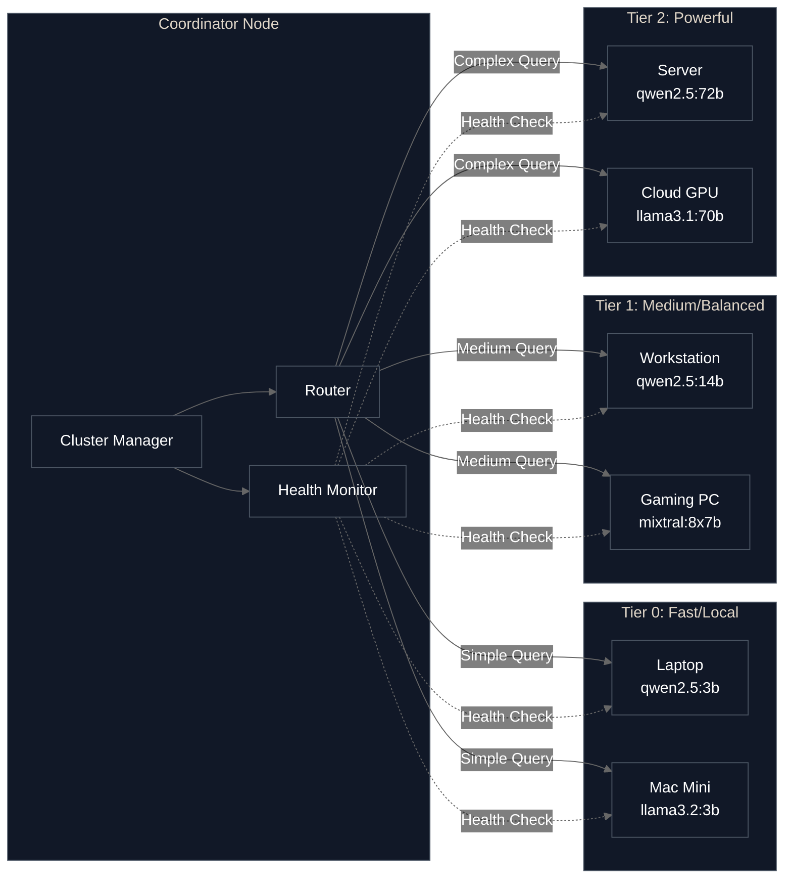

# harombe

> **Self-hosted agent framework for distributed AI**

Build autonomous AI agents that orchestrate workloads across your hardware—one machine or many—with zero cloud dependencies.

## What is harombe?

**harombe** is a general-purpose agent framework that orchestrates heterogeneous consumer hardware (Apple Silicon, NVIDIA, AMD, CPU) into a unified system for autonomous task execution. Define your cluster in YAML, create custom tools, and let harombe route workloads to the right hardware based on task complexity.

**The gap harombe fills:** No other open source project combines distributed inference across mixed hardware, autonomous agent loops with tool execution, and declarative cluster configuration. Existing solutions require either cloud providers, single-machine constraints, or complex DevOps expertise.

**Core capabilities:**
- **Autonomous execution:** Agents that plan, use tools, and execute multi-step tasks
- **Distributed orchestration:** Smart routing across heterogeneous hardware based on workload complexity
- **Privacy-first:** Your data, models, and workloads never leave your infrastructure
- **Extensible:** Add custom tools, backends, nodes, and agent behaviors
- **Observable:** Built-in metrics, health monitoring, circuit breakers, and failure recovery
- **Zero-config start:** `pip install harombe && harombe init && harombe chat` works in <5 minutes

**Use cases:**
- Interactive AI assistants with tool use (chat, voice)
- Automated data processing pipelines
- Code generation and analysis workflows
- Research automation with web search and file management
- Multi-modal agents (vision, audio - roadmap)

> **⚠️ Security Notice**
>
> harombe can execute shell commands and modify files. While dangerous operations require confirmation by default:
> - Review what the AI plans to do before approving
> - Run in sandboxed environments (Docker, VMs) when testing
> - Keep `confirm_dangerous: true` in your configuration
>
> See [SECURITY.md](SECURITY.md) for detailed security guidance.

## Architecture

harombe is a five-layer system designed for clarity and extensibility:

1. **Hardware Abstraction** - Auto-detects GPUs, recommends models
2. **Inference Abstraction** - Unified interface to Ollama, remote nodes, future backends
3. **Coordination** - Smart routing, health monitoring, metrics, load balancing
4. **Agent & Memory** - ReAct loop with tool execution and state management
5. **User Interface** - CLI and REST API

See [ARCHITECTURE.md](ARCHITECTURE.md) for detailed design documentation.

## Current Status

**Phase 0 (Complete):** Single-machine agent foundation
- Tool execution system (shell, filesystem, web search)
- ReAct agent loop with autonomous reasoning
- Hardware auto-detection and model selection
- Interactive CLI and REST API
- Zero-config deployment

**Phase 1 (Complete):** Multi-machine orchestration
- Cluster configuration and node management
- Smart routing based on task complexity
- Health monitoring with circuit breakers
- Performance metrics and observability
- mDNS service discovery

## Quick Start

### Prerequisites

- Python 3.11+
- [Ollama](https://ollama.ai) installed and running

### Installation

```bash
# Install harombe
pip install harombe

# Initialize configuration (detects your hardware)
harombe init

# Pull recommended model
ollama pull qwen2.5:7b  # or whatever model was recommended

# Start interactive agent
harombe chat
```

That's it! You have a working autonomous agent in under 5 minutes.

**Example multi-step task:**
```
You: Find all Python files in this directory that import 'requests',
     check which ones don't have error handling, and create a summary report.

Agent: I'll help you analyze Python files for requests usage and error handling.
       [Executing: find . -name "*.py"]
       [Executing: grep -l "import requests" on each file]
       [Reading files and analyzing error handling patterns]
       [Writing summary to requests_analysis.md]

       Done! I found 12 files using requests. 5 of them lack try-except blocks
       around HTTP calls. Summary saved to requests_analysis.md
```

The agent autonomously plans the workflow, executes tools, and delivers results.

## Usage

### Interactive Agent Interface

```bash
harombe chat
```

Interact with the autonomous agent through a conversational interface. The agent will:
- Reason about tasks and break them into steps
- Execute tools as needed (shell commands, file operations, web search)
- Handle multi-step workflows autonomously
- Ask for confirmation before dangerous operations

Commands:
- `/help` - Show available commands
- `/model` - Show current model info
- `/tools` - List enabled tools
- `/exit` - Exit interface

### Programmatic Access

```bash
# Start API server
harombe start

# Health check
curl http://localhost:8000/health

# Submit task to agent
curl -X POST http://localhost:8000/chat \
  -H "Content-Type: application/json" \
  -d '{"message": "Analyze the last 100 lines of system.log and summarize errors"}'
```

The REST API provides programmatic access to the agent system for integration with other tools, automation pipelines, or custom interfaces.

### Configuration

Configuration is stored at `~/.harombe/harombe.yaml`. Here's an example:

```yaml
model:
  name: qwen2.5:7b
  quantization: Q4_K_M
  context_length: 8192
  temperature: 0.7

ollama:
  host: http://localhost:11434
  timeout: 120

agent:
  max_steps: 10
  system_prompt: "You are Harombe, a helpful AI assistant..."

tools:
  shell: true
  filesystem: true
  web_search: true
  confirm_dangerous: true

server:
  host: 127.0.0.1
  port: 8000
```

All fields have sensible defaults - you can run with an empty config file or no config at all!

### Multi-Machine Clusters (Experimental)

harombe can orchestrate inference across multiple machines with different hardware capabilities:

```bash
# Generate cluster configuration template
harombe cluster init

# Check cluster status
harombe cluster status

# Test connectivity to all nodes
harombe cluster test
```

Example cluster configuration:

```yaml
cluster:
  coordinator:
    host: localhost

  routing:
    prefer_local: true          # Prefer lowest latency nodes
    fallback_strategy: graceful # Try other tiers if preferred unavailable
    load_balance: true          # Distribute across same-tier nodes

  nodes:
    # Fast/local node for simple queries
    - name: laptop
      host: localhost
      port: 8000
      model: qwen2.5:3b
      tier: 0

    # Balanced node for medium workloads
    - name: workstation
      host: 192.168.1.100
      port: 8000
      model: qwen2.5:14b
      tier: 1

    # Powerful node for complex tasks
    - name: server
      host: server.local
      port: 8000
      model: qwen2.5:72b
      tier: 2
```

**Tiers are user-defined** - assign based on your judgment of hardware capabilities:
- **Tier 0** (fast): Low latency, simple queries
- **Tier 1** (medium): Balanced performance
- **Tier 2** (powerful): Complex queries, large context

Works with any hardware mix: Apple Silicon, NVIDIA, AMD, CPU, cloud instances.

#### Cluster Topology



#### Setting Up Multi-Machine Clusters

Each node in your cluster runs harombe in server mode. Here's how to set it up:

**On each node machine:**

1. Install harombe and dependencies:
```bash
# Install harombe
pip install harombe

# Ensure Ollama is running
ollama serve &

# Pull the model for this node
ollama pull qwen2.5:14b  # or whichever model this node will run
```

2. Create configuration file at `~/.harombe/harombe.yaml`:
```yaml
model:
  name: qwen2.5:14b  # Model for this specific node

server:
  host: 0.0.0.0  # Listen on all interfaces
  port: 8000

ollama:
  host: http://localhost:11434
```

3. Start the harombe server:
```bash
harombe start
```

4. Verify it's accessible:
```bash
curl http://<node-ip>:8000/health
```

**On the coordinator machine:**

Add the cluster configuration to your `~/.harombe/harombe.yaml`:

```yaml
cluster:
  nodes:
    - name: workstation
      host: 192.168.1.100  # IP or hostname of the node
      port: 8000
      model: qwen2.5:14b
      tier: 1

    # Add more nodes...
```

Then check cluster status:
```bash
harombe cluster status
```

**Network Requirements:**
- All nodes must be network-accessible from the coordinator
- Port 8000 (or your configured port) must be open on each node
- For SSH-based deployments, consider using SSH tunneling for secure connections

## How It Works

### Single Machine
1. `harombe init` detects your hardware and recommends a model
2. `harombe chat` starts the agent loop locally
3. Queries are processed with tool calling (shell, files, web search)

### Cluster Mode
1. Define nodes in YAML (each machine runs `harombe start`)
2. Coordinator analyzes query complexity
3. Routes to appropriate tier (fast/local → tier 0, complex → tier 2)
4. Monitors health, handles failures with circuit breakers

**Visual Overview:**

See [ARCHITECTURE.md](ARCHITECTURE.md) for the full five-layer system design, component details, and design decisions.

## Roadmap

### Phase 0: Weekend MVP (Complete)
- Single-machine AI assistant with tool calling
- ReAct agent loop
- Hardware auto-detection
- Interactive CLI and REST API

### Phase 1: Multi-Machine Orchestration (Complete)
- **Phase 1.1** (Complete): Cluster foundation
  - Cluster configuration schema
  - Remote LLM client
  - Health monitoring and node selection
  - CLI commands for cluster management

- **Phase 1.2** (Complete): Discovery & Health
  - mDNS auto-discovery for local networks
  - Periodic health monitoring
  - Circuit breaker pattern
  - Retry logic with exponential backoff

- **Phase 1.3** (Complete): Smart Routing
  - Task complexity classification
  - Context-aware routing decisions
  - Automatic tier selection
  - Integration with agent loop

- **Phase 1.4** (Complete): Polish & Monitoring
  - Dynamic node management (add/remove nodes at runtime)
  - Performance metrics collection and tracking
  - REST API metrics endpoint
  - CLI metrics command

### Phase 2: Memory & Privacy (Future)
- Long-term conversation memory
- Vector store integration
- Privacy router for PII detection
- Knowledge base management

### Phase 3: Advanced Features (Future)
- Voice input/output (STT/TTS)
- Web UI with real-time updates
- Plugin system for custom tools
- Multi-modal support (vision, audio)

## Troubleshooting

### Ollama Not Running

If you see errors about connecting to Ollama:

```bash
# Start Ollama server
ollama serve

# In another terminal, verify it's running
curl http://localhost:11434/api/tags
```

### Model Not Found

If harombe can't find your model:

```bash
# List available models
ollama list

# Pull a model (recommended: qwen2.5:7b)
ollama pull qwen2.5:7b

# Update your config
nano ~/.harombe/harombe.yaml  # Change model.name
```

### Installation Issues

```bash
# Ensure Python 3.11+ is installed
python3 --version

# Upgrade pip
pip install --upgrade pip

# Reinstall harombe
pip install --force-reinstall harombe
```

### Permission Errors

If you get permission errors during tool execution:

1. Check that `confirm_dangerous: true` in your config
2. Review the operation before approving
3. Consider running in a sandboxed environment

### Getting Help

- Check existing [Issues](https://github.com/smallthinkingmachines/harombe/issues)
- Start a [Discussion](https://github.com/smallthinkingmachines/harombe/discussions)
- Review the [Security Policy](SECURITY.md) for security concerns

## Development

See [docs/DEVELOPMENT.md](docs/DEVELOPMENT.md) for detailed setup instructions.

Quick start:
```bash
# Clone and setup
git clone https://github.com/smallthinkingmachines/harombe.git
cd harombe
python -m venv .venv
source .venv/bin/activate  # On Windows: .venv\Scripts\activate
pip install -e ".[dev]"

# Run tests
pytest
```

## Contributing

We welcome contributions! See [docs/CONTRIBUTING.md](docs/CONTRIBUTING.md) for guidelines.

Quick contribution workflow:
1. Fork and clone the repository
2. Create a feature branch
3. Make your changes with tests
4. Run `pytest` and `ruff format .`
5. Submit a Pull Request

## License

Apache 2.0 - see [LICENSE](LICENSE)

## Credits

A smallthinkingmachines project.

Built with:
- [Ollama](https://ollama.ai) - Local LLM inference
- [OpenAI SDK](https://github.com/openai/openai-python) - LLM client
- [Typer](https://typer.tiangolo.com) - CLI framework
- [FastAPI](https://fastapi.tiangolo.com) - API server
- [Rich](https://rich.readthedocs.io) - Terminal UI
- [Pydantic](https://docs.pydantic.dev) - Configuration validation

## Support

- [Documentation](https://github.com/smallthinkingmachines/harombe#readme)
- [Issues](https://github.com/smallthinkingmachines/harombe/issues)
- [Discussions](https://github.com/smallthinkingmachines/harombe/discussions)
