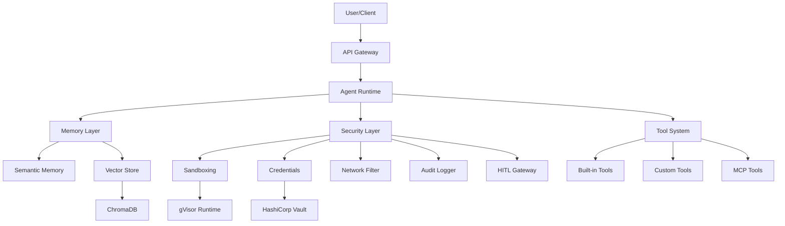
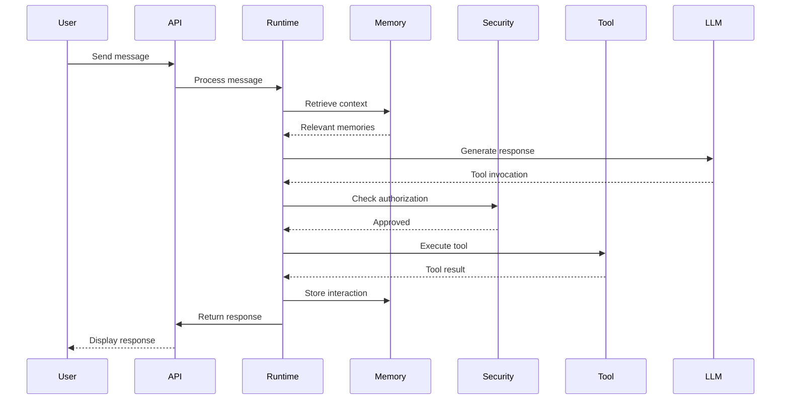
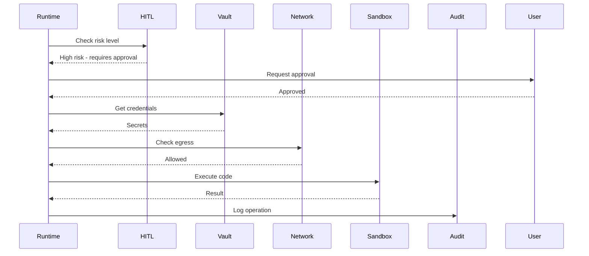

# Architecture Overview

Harombe is built with a modular, layered architecture that prioritizes security, extensibility, and performance.

## High-Level Architecture



## Core Components

### 1. Agent Runtime

The Agent Runtime is the central orchestration layer that coordinates all agent operations.

**Responsibilities**:

- Message processing and routing
- Tool invocation
- Memory retrieval and storage
- Security policy enforcement
- Iteration management

**Key Classes**:

- `AgentRuntime`: Main orchestration
- `AgentConfig`: Configuration management
- `ConversationManager`: Conversation state
- `ToolRegistry`: Tool discovery and invocation

### 2. Memory Layer

The Memory Layer provides semantic memory with RAG (Retrieval-Augmented Generation) capabilities.

**Components**:

- **Semantic Memory**: Long-term memory with semantic search
- **Vector Store**: ChromaDB for embeddings
- **Embedding Manager**: Generate and manage embeddings
- **Context Manager**: Manage conversation context window

**Features**:

- Automatic memory consolidation
- Semantic similarity search
- Context-aware retrieval
- Token budget management

Learn more: [Memory Architecture](../memory-architecture.md)

### 3. Security Layer

The Security Layer implements defense-in-depth security with five layers of protection.

**Layers**:

1. **Audit Logging**: Immutable event trail
2. **Execution Isolation**: gVisor sandboxing
3. **Credential Management**: Vault-based secrets
4. **Network Security**: Egress filtering
5. **Human-in-the-Loop**: Risk-based approvals

**Components**:

- `SandboxManager`: Container-based code execution
- `VaultClient`: Secret retrieval from Vault
- `NetworkFilter`: Egress traffic filtering
- `AuditLogger`: Immutable audit trail
- `HITLGateway`: Human approval workflow
- `SecretScanner`: Credential leak detection

Learn more: [Security Architecture](../security-architecture.md)

### 4. Tool System

The Tool System provides extensible capabilities through a plugin architecture.

**Tool Types**:

- **Built-in Tools**: File operations, code execution, web search
- **Custom Tools**: User-defined tools
- **MCP Tools**: Model Context Protocol integration

**Features**:

- Dynamic tool discovery
- Type-safe tool definitions
- Automatic parameter validation
- Tool result caching

Learn more: [MCP Gateway Design](../mcp-gateway-design.md)

## Data Flow

### Message Processing Flow



### Security Check Flow



## Key Design Principles

### 1. Security by Default

All security features are enabled by default in production:

- Code execution always sandboxed
- Secrets never in plaintext
- All egress traffic filtered
- Complete audit trail
- High-risk operations require approval

### 2. Fail Secure

On errors, the system defaults to the secure option:

- Network filter error → Deny traffic
- HITL timeout → Deny operation
- Vault connection error → Abort operation
- Sandbox creation error → Abort execution

### 3. Defense in Depth

Multiple overlapping security controls ensure no single point of failure:

- Sandbox isolation + syscall filtering
- Egress filtering + TLS verification
- Secret scanning + Vault storage
- Audit logging + HITL gates

### 4. Zero Trust

No implicit trust in any component:

- All code runs in sandbox (even agent-generated)
- All secrets from Vault (no environment variables)
- All egress checked (no automatic allowlist)
- All high-risk ops require approval

### 5. Observable

Complete visibility into system behavior:

- Comprehensive audit logging
- Structured logging
- Performance metrics
- Security events

### 6. Extensible

Easy to extend without compromising security:

- Plugin architecture for tools
- MCP protocol support
- Custom security policies
- Configurable risk levels

## Performance Characteristics

### Latency

| Operation           | Target   | Actual       |
| ------------------- | -------- | ------------ |
| Audit Log Write     | <10ms    | **0.56ms**   |
| Network Check       | <10ms    | **<1ms**     |
| HITL Classification | <50ms    | **0.0001ms** |
| Memory Retrieval    | <100ms   | **~50ms**    |
| Code Execution      | <100ms\* | **0.32ms\*** |

_\* Overhead only, not including actual code execution time_

### Throughput

| Component           | Throughput        |
| ------------------- | ----------------- |
| HITL Classification | 601,249 ops/sec   |
| Audit Writes        | 1,700+ events/sec |
| Memory Queries      | 100+ queries/sec  |

### Resource Usage

| Component      | Memory | CPU    |
| -------------- | ------ | ------ |
| Agent Runtime  | ~200MB | <10%   |
| ChromaDB       | ~500MB | <20%   |
| Sandbox (each) | ~512MB | 1 core |

## Scalability

### Horizontal Scaling

- **Stateless Agent Runtime**: Scale instances independently
- **Shared Vector Store**: ChromaDB cluster support
- **Shared Vault**: Centralized credential management
- **Load Balancing**: Standard HTTP load balancing

### Vertical Scaling

- **Memory**: Increase for larger vector store
- **CPU**: Increase for more concurrent sandboxes
- **Disk**: Increase for audit logs and embeddings

### Limits

| Resource             | Default   | Maximum     |
| -------------------- | --------- | ----------- |
| Concurrent Sandboxes | 10        | Unlimited\* |
| Memory per Sandbox   | 512MB     | 8GB         |
| CPU per Sandbox      | 1 core    | 4 cores     |
| Audit Log Size       | Unlimited | Disk limit  |
| Vector Store Size    | Unlimited | Disk limit  |

_\* Limited by available CPU/memory_

## Technology Stack

### Core

- **Python 3.11+**: Application language
- **FastAPI**: API framework (optional)
- **Pydantic**: Data validation
- **asyncio**: Async runtime

### AI/ML

- **Anthropic Claude**: Primary LLM
- **OpenAI**: Embeddings (optional)
- **ChromaDB**: Vector database
- **Sentence Transformers**: Local embeddings

### Security

- **Docker + gVisor**: Code sandboxing
- **HashiCorp Vault**: Credential management
- **SQLite (WAL)**: Audit logging

### Development

- **Pytest**: Testing framework
- **Ruff**: Linting and formatting
- **MyPy**: Type checking
- **Pre-commit**: Git hooks

## Deployment Architectures

### Single-Node Deployment

```
┌─────────────────────────────────────┐
│          Single Server              │
│                                     │
│  ┌──────────────────────────────┐  │
│  │     Agent Runtime            │  │
│  │     + Memory                 │  │
│  │     + Security               │  │
│  │     + Tools                  │  │
│  └──────────────────────────────┘  │
│                                     │
│  ┌──────────────────────────────┐  │
│  │     ChromaDB                 │  │
│  └──────────────────────────────┘  │
│                                     │
│  ┌──────────────────────────────┐  │
│  │     Vault                    │  │
│  └──────────────────────────────┘  │
└─────────────────────────────────────┘
```

**Use Case**: Development, small deployments

### Multi-Node Deployment

```
┌────────────────┐  ┌────────────────┐
│  Agent Node 1  │  │  Agent Node 2  │
│  (Runtime)     │  │  (Runtime)     │
└────────┬───────┘  └────────┬───────┘
         │                    │
         └──────────┬─────────┘
                    │
        ┌───────────▼────────────┐
        │    Load Balancer       │
        └───────────┬────────────┘
                    │
         ┌──────────┴──────────┐
         │                     │
    ┌────▼────┐         ┌─────▼─────┐
    │ ChromaDB│         │   Vault   │
    │ Cluster │         │  Cluster  │
    └─────────┘         └───────────┘
```

**Use Case**: Production, high availability

## Next Steps

- [Memory Architecture](../memory-architecture.md) - Deep dive into memory system
- [Security Architecture](../security-architecture.md) - Deep dive into security
- [MCP Gateway](../mcp-gateway-design.md) - Tool integration
- [Production Deployment](../production-deployment-guide.md) - Deploy to production
