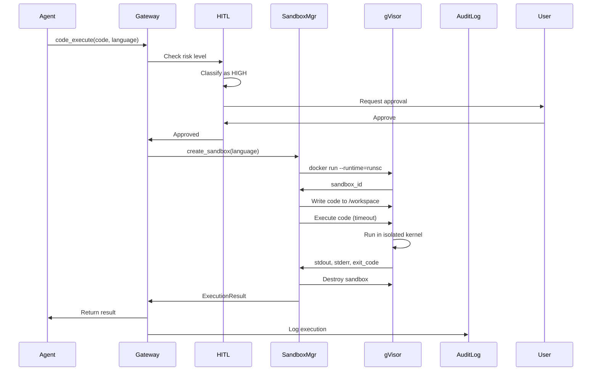
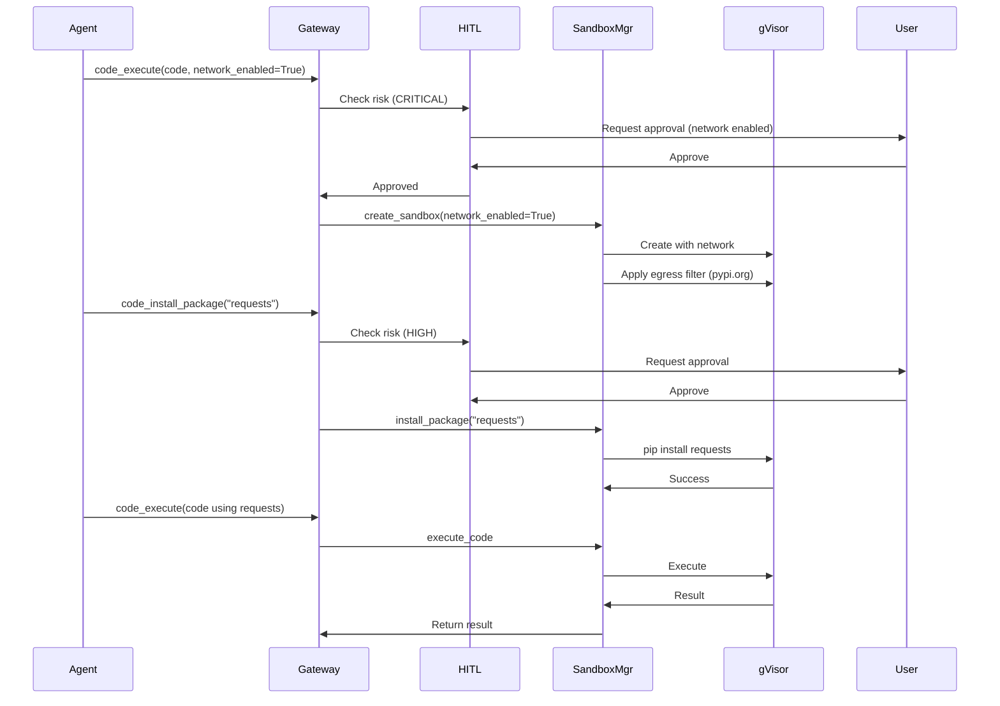

# Code Execution Sandbox Design

**Phase 4.7 - gVisor-Based Code Execution**

This document describes the architecture for secure code execution using gVisor sandboxing, providing stronger isolation than Docker containers alone while maintaining practical usability for AI agent workflows.

## Overview

The code execution sandbox allows AI agents to run arbitrary code (Python, JavaScript, shell scripts) in a highly isolated environment with:

- **gVisor kernel isolation** - Application kernel in userspace, limiting host kernel exposure
- **Air-gapped by default** - No network access unless explicitly enabled
- **Resource constraints** - CPU, memory, disk, and time limits
- **Filesystem isolation** - Temporary workspace, no host filesystem access
- **Optional package installation** - Allowlisted registries (PyPI, npm) when needed
- **Multi-language support** - Python, Node.js, shell scripts
- **HITL integration** - Risk-based approval for sensitive operations

## Architecture

### System Diagram

```
┌─────────────────────────────────────────────────────┐
│  Agent (via MCP Gateway)                            │
│  Requests code execution via code_execute tool      │
└─────────────────────────────────────────────────────┘
                    │
                    ▼
┌─────────────────────────────────────────────────────┐
│  HITL Gate (Risk Classifier)                        │
│  Classifies operation risk (LOW/MED/HIGH/CRITICAL)  │
│  Requires approval for HIGH+ operations             │
└─────────────────────────────────────────────────────┘
                    │
                    ▼
┌─────────────────────────────────────────────────────┐
│  SandboxManager                                     │
│  - Creates gVisor sandbox container                 │
│  - Injects code into isolated workspace             │
│  - Configures resource limits                       │
│  - Optionally enables network (allowlisted domains) │
│  - Captures stdout/stderr/exit_code                 │
└─────────────────────────────────────────────────────┘
                    │
                    ▼
┌─────────────────────────────────────────────────────┐
│  gVisor Sandbox (runsc runtime)                     │
│                                                     │
│  ┌───────────────────────────────────────────────┐ │
│  │ Application Kernel (Go, userspace)            │ │
│  │ - Intercepts syscalls                         │ │
│  │ - Virtualizes devices                         │ │
│  │ - Isolates from host kernel                   │ │
│  └───────────────────────────────────────────────┘ │
│                                                     │
│  ┌───────────────────────────────────────────────┐ │
│  │ Code Execution Environment                    │ │
│  │ - Python 3.11+ / Node.js 20+ / Bash          │ │
│  │ - Temporary workspace: /workspace             │ │
│  │ - No host filesystem access                   │ │
│  │ - Network: disabled (or allowlisted domains)  │ │
│  └───────────────────────────────────────────────┘ │
└─────────────────────────────────────────────────────┘
                    │
                    ▼
┌─────────────────────────────────────────────────────┐
│  Audit Logger                                       │
│  - Logs all code execution requests                 │
│  - Records approval decisions                       │
│  - Tracks execution results and errors              │
└─────────────────────────────────────────────────────┘
```

### Components

#### 1. SandboxManager

**Purpose:** Manages gVisor sandbox lifecycle and code execution.

**Responsibilities:**

- Create and configure gVisor sandbox containers
- Inject code into isolated workspace
- Apply resource limits (CPU, memory, disk, time)
- Configure network isolation (disabled by default)
- Execute code and capture results
- Cleanup sandbox after execution

**Key Methods:**

```python
class SandboxManager:
    async def create_sandbox(
        self,
        language: str,
        sandbox_id: str | None = None,
        network_enabled: bool = False,
        allowed_domains: list[str] | None = None,
    ) -> str

    async def execute_code(
        self,
        sandbox_id: str,
        code: str,
        timeout: int = 30,
        max_memory_mb: int = 512,
    ) -> ExecutionResult

    async def install_package(
        self,
        sandbox_id: str,
        package: str,
        registry: str = "pypi",
    ) -> InstallResult

    async def write_file(
        self,
        sandbox_id: str,
        file_path: str,
        content: str,
    ) -> WriteResult

    async def read_file(
        self,
        sandbox_id: str,
        file_path: str,
    ) -> ReadResult

    async def list_files(
        self,
        sandbox_id: str,
        path: str = "/workspace",
    ) -> ListResult

    async def destroy_sandbox(
        self,
        sandbox_id: str,
    ) -> None
```

#### 2. Code Execution Tools

**Purpose:** MCP-compatible tools for agent code execution.

**Tools:**

1. **code_execute** - Execute code in sandbox
2. **code_install_package** - Install packages from registries
3. **code_write_file** - Write files to workspace
4. **code_read_file** - Read files from workspace
5. **code_list_files** - List files in workspace
6. **code_destroy_sandbox** - Cleanup sandbox

**Example Tool Schema:**

```python
{
    "name": "code_execute",
    "description": "Execute code in isolated gVisor sandbox",
    "inputSchema": {
        "type": "object",
        "properties": {
            "language": {
                "type": "string",
                "enum": ["python", "javascript", "shell"],
                "description": "Programming language"
            },
            "code": {
                "type": "string",
                "description": "Code to execute"
            },
            "timeout": {
                "type": "integer",
                "default": 30,
                "description": "Execution timeout in seconds"
            },
            "network_enabled": {
                "type": "boolean",
                "default": false,
                "description": "Enable network access (requires approval)"
            },
            "allowed_domains": {
                "type": "array",
                "items": {"type": "string"},
                "description": "Allowlisted domains (when network enabled)"
            }
        },
        "required": ["language", "code"]
    }
}
```

#### 3. Risk Classification Rules

**Purpose:** HITL integration for code execution operations.

**Risk Levels:**

**CRITICAL** (30s timeout):

- Code execution with network enabled
- Installing packages from non-standard registries
- Code containing dangerous patterns (rm -rf, curl | sh, eval)

**HIGH** (60s timeout):

- Any code execution (default)
- Installing packages from standard registries
- Writing executable files

**MEDIUM** (120s timeout):

- Reading/writing non-executable files
- Listing files in workspace

**LOW** (auto-approved):

- Destroying sandbox (cleanup)
- Reading sandbox metadata

**Example Rules:**

```python
HITLRule(
    tools=["code_execute"],
    risk=RiskLevel.CRITICAL,
    conditions=[
        {"param": "network_enabled", "equals": True}
    ],
    timeout=30,
    description="Code execution with network access"
),
HITLRule(
    tools=["code_execute"],
    risk=RiskLevel.CRITICAL,
    conditions=[
        {"param": "code", "matches": r"(?i)(rm\s+-rf|curl.*\|\s*sh|eval\(|exec\()"}
    ],
    timeout=30,
    description="Dangerous code patterns detected"
),
HITLRule(
    tools=["code_execute"],
    risk=RiskLevel.HIGH,
    require_approval=True,
    timeout=60,
    description="Code execution in sandbox"
),
HITLRule(
    tools=["code_install_package"],
    risk=RiskLevel.HIGH,
    timeout=60,
    description="Package installation"
),
```

## gVisor Integration

### Why gVisor?

Traditional Docker containers share the host kernel, which exposes a large attack surface (~300+ syscalls). gVisor provides:

1. **Application kernel in userspace** - Written in memory-safe Go
2. **Syscall interception** - Limits host kernel exposure to ~70 syscalls
3. **No VM overhead** - Faster startup than VMs, lighter than Kata Containers
4. **Production-ready** - Used by Google GKE, maintained by Google

**Security Comparison:**

| Feature           | Docker     | Docker + gVisor       | VM (Firecracker) |
| ----------------- | ---------- | --------------------- | ---------------- |
| Kernel isolation  | ❌ Shared  | ✅ Isolated           | ✅ Isolated      |
| Syscall filtering | ⚠️ seccomp | ✅ Application kernel | ✅ Full VM       |
| Startup time      | ~100ms     | ~500ms                | ~1s              |
| Memory overhead   | ~10MB      | ~50MB                 | ~150MB           |
| I/O performance   | Excellent  | Good                  | Fair             |

**References:**

- [gVisor Official Documentation](https://gvisor.dev/)
- [How to sandbox AI agents in 2026](https://northflank.com/blog/how-to-sandbox-ai-agents)
- [4 ways to sandbox untrusted code in 2026](https://dev.to/mohameddiallo/4-ways-to-sandbox-untrusted-code-in-2026-1ffb)

### Installation

**Installing gVisor:**

```bash
# Download runsc
wget https://storage.googleapis.com/gvisor/releases/release/latest/$(uname -m)/runsc
chmod +x runsc
sudo mv runsc /usr/local/bin/

# Configure Docker to use runsc
sudo runsc install

# Verify installation
docker run --runtime=runsc --rm hello-world
```

**Docker Configuration (`/etc/docker/daemon.json`):**

```json
{
  "runtimes": {
    "runsc": {
      "path": "/usr/local/bin/runsc",
      "runtimeArgs": ["--network=none"]
    }
  }
}
```

**Reference:** [gVisor Docker Quick Start](https://gvisor.dev/docs/user_guide/quick_start/docker/)

### Docker Integration

**Creating gVisor Sandbox:**

```python
# Create container with runsc runtime
container = await docker_client.containers.create(
    image="harombe/code-sandbox:python3.11",
    runtime="runsc",  # Use gVisor
    command=["python", "/workspace/script.py"],
    network_mode="none",  # Air-gapped
    mem_limit="512m",
    cpu_period=100000,
    cpu_quota=50000,  # 50% of 1 CPU
    volumes={
        temp_workspace: {
            "bind": "/workspace",
            "mode": "rw"
        }
    },
    working_dir="/workspace",
    remove=True,  # Auto-cleanup
)
```

**With Network (Optional):**

```python
# Create custom network with egress filtering
network = await docker_client.networks.create(
    name=f"sandbox-{sandbox_id}",
    driver="bridge",
    options={
        "com.docker.network.bridge.enable_icc": "false",
        "com.docker.network.bridge.enable_ip_masquerade": "true"
    }
)

# Apply iptables rules for domain allowlist
# (Similar to Phase 4.4 network isolation)
await apply_egress_filter(
    container_id=container.id,
    allowed_domains=["pypi.org", "files.pythonhosted.org"]
)
```

## Supported Languages

### Python

**Runtime:** Python 3.11+

**Default Packages:**

- Standard library only
- No pre-installed third-party packages

**Package Installation:**

```python
await sandbox.install_package(
    sandbox_id=sandbox_id,
    package="requests==2.31.0",
    registry="pypi"
)
```

**Execution:**

```python
result = await sandbox.execute_code(
    sandbox_id=sandbox_id,
    code="""
import sys
print(f"Python {sys.version}")
print("Hello from gVisor sandbox!")
""",
    timeout=30
)
```

### JavaScript (Node.js)

**Runtime:** Node.js 20+

**Default Packages:**

- Node.js core modules only
- No pre-installed npm packages

**Package Installation:**

```python
await sandbox.install_package(
    sandbox_id=sandbox_id,
    package="axios@1.6.0",
    registry="npm"
)
```

**Execution:**

```python
result = await sandbox.execute_code(
    sandbox_id=sandbox_id,
    code="""
console.log(`Node.js ${process.version}`);
console.log("Hello from gVisor sandbox!");
""",
    timeout=30
)
```

### Shell

**Runtime:** Bash 5.2+

**Available Commands:**

- Basic POSIX utilities (ls, cat, grep, etc.)
- No network utilities (curl, wget) unless network enabled

**Execution:**

```python
result = await sandbox.execute_code(
    sandbox_id=sandbox_id,
    code="""
echo "Shell: $BASH_VERSION"
ls -la /workspace
""",
    timeout=30
)
```

## Resource Constraints

### Default Limits

```python
DEFAULT_LIMITS = {
    "max_memory_mb": 512,      # 512MB RAM
    "max_cpu_cores": 0.5,      # 50% of 1 CPU core
    "max_disk_mb": 1024,       # 1GB disk
    "max_execution_time": 30,  # 30 seconds
    "max_output_bytes": 1_048_576,  # 1MB stdout/stderr
}
```

### Configurable Per Execution

```python
result = await sandbox.execute_code(
    sandbox_id=sandbox_id,
    code=code,
    timeout=60,               # Override default timeout
    max_memory_mb=1024,       # Override default memory
    max_output_bytes=5_242_880  # 5MB output
)
```

### Enforcement

**Time Limits:**

- Enforced by Docker timeout
- SIGTERM after timeout, then SIGKILL after grace period

**Memory Limits:**

- Enforced by Docker cgroup limits
- OOM killer terminates process if exceeded

**Disk Limits:**

- Enforced by tmpfs mount with size limit
- Write fails when limit reached

**Output Limits:**

- Enforced by capture buffer size
- Truncated with warning if exceeded

## Network Isolation

### Default: Air-Gapped

**Network disabled by default:**

```python
result = await sandbox.execute_code(
    sandbox_id=sandbox_id,
    code="import requests; requests.get('https://example.com')",
    # network_enabled=False (default)
)
# Result: ConnectionError (no network access)
```

### Optional: Allowlisted Domains

**Enable network with domain allowlist:**

```python
result = await sandbox.execute_code(
    sandbox_id=sandbox_id,
    code="""
import requests
response = requests.get('https://pypi.org')
print(response.status_code)
""",
    network_enabled=True,
    allowed_domains=["pypi.org", "files.pythonhosted.org"]
)
# Result: 200 (pypi.org accessible)

result2 = await sandbox.execute_code(
    sandbox_id=sandbox_id,
    code="import requests; requests.get('https://evil.com')",
    network_enabled=True,
    allowed_domains=["pypi.org"]
)
# Result: ConnectionError (evil.com blocked)
```

**Implementation:**

- Reuses Phase 4.4 network isolation (iptables egress filtering)
- DNS resolution controlled by custom DNS server
- All traffic outside allowlist dropped

## Filesystem Isolation

### Workspace Structure

```
/workspace/          # Temporary directory (tmpfs, size-limited)
├── script.py        # Injected code file
├── output.txt       # Agent-created files
└── data/            # Agent-created directories
    └── results.json
```

### No Host Access

**Blocked:**

- No access to host filesystem
- No access to /proc, /sys (filtered by gVisor)
- No access to other containers

**Temporary Workspace:**

- Created per sandbox
- Destroyed after execution
- Max size: 1GB (configurable)

### File Operations

**Write File:**

```python
await sandbox.write_file(
    sandbox_id=sandbox_id,
    file_path="/workspace/config.json",
    content='{"key": "value"}'
)
```

**Read File:**

```python
result = await sandbox.read_file(
    sandbox_id=sandbox_id,
    file_path="/workspace/output.txt"
)
print(result.content)
```

**List Files:**

```python
result = await sandbox.list_files(
    sandbox_id=sandbox_id,
    path="/workspace"
)
print(result.files)  # ["script.py", "output.txt", "data/"]
```

## Security Model

### Threat Model

**Threats Mitigated:**

1. **Kernel exploits** - gVisor isolates from host kernel
2. **Container escape** - Application kernel in userspace prevents breakout
3. **Resource exhaustion** - CPU/memory/disk limits prevent DoS
4. **Data exfiltration** - Network disabled by default, allowlisted when enabled
5. **Malicious code execution** - Sandbox isolation limits blast radius

**Threats NOT Mitigated:**

1. **Logic bombs** - Malicious code that appears benign
2. **Side-channel attacks** - Timing attacks, speculative execution
3. **Social engineering** - Convincing user to approve dangerous operations

### Defense in Depth

**Layer 1: HITL Gates**

- User approval required for HIGH+ risk operations
- Dangerous code patterns detected and flagged

**Layer 2: gVisor Isolation**

- Application kernel limits host kernel exposure
- Syscall interception prevents kernel exploits

**Layer 3: Resource Limits**

- Time limits prevent infinite loops
- Memory limits prevent DoS
- Disk limits prevent storage exhaustion

**Layer 4: Network Isolation**

- Air-gapped by default
- Allowlist-based egress filtering when network needed

**Layer 5: Audit Logging**

- All code execution logged
- Approval decisions recorded
- Results and errors tracked

### Security Best Practices

1. **Always require HITL approval** for code execution
2. **Keep network disabled** unless absolutely necessary
3. **Use minimal allowlists** when network is required
4. **Review code before approving** - check for dangerous patterns
5. **Monitor audit logs** for suspicious activity
6. **Keep gVisor updated** - security patches and improvements

## Execution Flow

### Standard Code Execution



### With Package Installation



## Configuration

### YAML Configuration

```yaml
security:
  sandbox:
    enabled: true
    runtime: runsc # gVisor runtime

    # Default resource limits
    limits:
      max_memory_mb: 512
      max_cpu_cores: 0.5
      max_disk_mb: 1024
      max_execution_time: 30
      max_output_bytes: 1048576

    # Network configuration
    network:
      enabled_by_default: false
      allowed_registries:
        pypi:
          - pypi.org
          - files.pythonhosted.org
        npm:
          - registry.npmjs.org
          - registry.npmjs.com

    # Supported languages
    languages:
      python:
        image: harombe/sandbox-python:3.11
        default_packages: []
      javascript:
        image: harombe/sandbox-node:20
        default_packages: []
      shell:
        image: harombe/sandbox-shell:latest
        default_packages: []

    # HITL integration
    hitl:
      enabled: true
      auto_approve_low_risk: true
```

## Docker Images

### Python Sandbox Image

**Dockerfile (`docker/sandbox-python.Dockerfile`):**

```dockerfile
FROM python:3.11-slim

# Install minimal dependencies
RUN apt-get update && apt-get install -y --no-install-recommends \
    ca-certificates \
    && rm -rf /var/lib/apt/lists/*

# Create workspace
RUN mkdir /workspace
WORKDIR /workspace

# Non-root user
RUN useradd -m -u 1000 sandbox
USER sandbox

# No default packages (install on demand)
CMD ["python", "--version"]
```

### Node.js Sandbox Image

**Dockerfile (`docker/sandbox-node.Dockerfile`):**

```dockerfile
FROM node:20-slim

# Install minimal dependencies
RUN apt-get update && apt-get install -y --no-install-recommends \
    ca-certificates \
    && rm -rf /var/lib/apt/lists/*

# Create workspace
RUN mkdir /workspace
WORKDIR /workspace

# Non-root user
RUN useradd -m -u 1000 sandbox
USER sandbox

# No default packages
CMD ["node", "--version"]
```

## Testing Strategy

### Unit Tests

**Test sandbox manager:**

- Sandbox creation and destruction
- Code execution with various languages
- Resource limit enforcement
- Network isolation verification
- File operations

**Test code execution tools:**

- Tool invocation with valid inputs
- Error handling for invalid inputs
- HITL integration
- Result serialization

### Integration Tests

**Test gVisor isolation:**

- Verify syscall filtering
- Attempt kernel exploits (should fail)
- Verify network isolation
- Verify filesystem isolation

**Test resource limits:**

- Execution timeout enforcement
- Memory limit enforcement (OOM killer)
- Disk limit enforcement
- Output truncation

### Security Tests

**Test dangerous code patterns:**

- Shell command injection attempts
- Path traversal attempts
- Network exfiltration attempts (when disabled)
- Resource exhaustion attempts

## Implementation Phases

### Phase 1: Core Sandbox Manager

1. Install and configure gVisor
2. Implement `SandboxManager` class
3. Support Python execution
4. Basic resource limits
5. Unit tests

### Phase 2: Multi-Language Support

1. Add Node.js support
2. Add shell script support
3. Unified execution interface
4. Language-specific handling

### Phase 3: Network & Packages

1. Optional network enablement
2. Egress filtering integration (Phase 4.4)
3. Package installation (pip, npm)
4. Registry allowlists

### Phase 4: MCP Tools & HITL

1. Implement code execution tools
2. Define risk classification rules
3. HITL integration
4. Audit logging integration

### Phase 5: Testing & Documentation

1. Comprehensive test suite
2. Usage documentation
3. Security guide
4. Architecture updates

## Future Enhancements

**Persistent Sandboxes:**

- Reuse sandbox across multiple executions
- Faster iteration for development workflows

**More Languages:**

- Go, Rust, Java support
- Custom language runtime plugins

**Advanced Security:**

- Seccomp profile customization
- SELinux/AppArmor policies
- Rootless containers

**Performance Optimization:**

- Sandbox pool (pre-created sandboxes)
- Faster cold starts
- Streaming output

## References

- [gVisor Official Documentation](https://gvisor.dev/)
- [gVisor Docker Quick Start](https://gvisor.dev/docs/user_guide/quick_start/docker/)
- [How to sandbox AI agents in 2026](https://northflank.com/blog/how-to-sandbox-ai-agents)
- [4 ways to sandbox untrusted code in 2026](https://dev.to/mohameddiallo/4-ways-to-sandbox-untrusted-code-in-2026-1ffb)
- [gVisor Security Model](https://gvisor.dev/docs/architecture_guide/intro/)
- [Container Sandboxing with gVisor](https://medium.com/geekculture/container-sandboxing-gvisor-b191dafdc8a2)

## Next Steps

1. Review and approve this design
2. Set up gVisor development environment
3. Implement `SandboxManager` (Phase 1)
4. Add multi-language support (Phase 2)
5. Integrate with MCP Gateway (Phase 3-4)
6. Complete testing and documentation (Phase 5)
