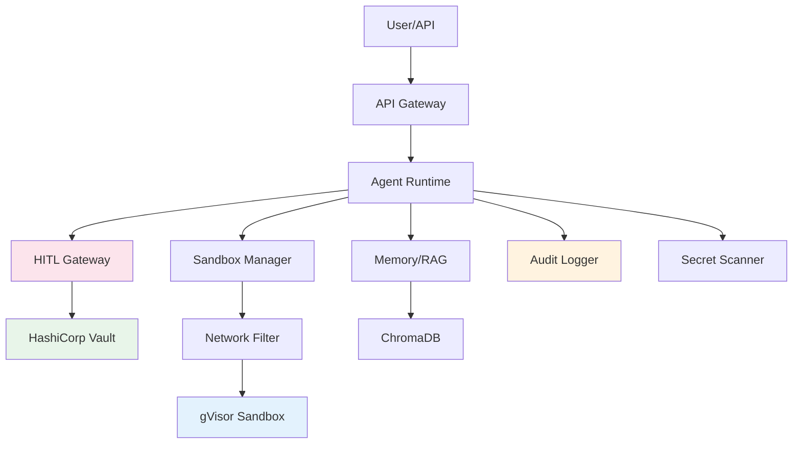

# Harombe

**Secure, intelligent AI agent framework with defense-in-depth security**

<div class="grid cards" markdown>

- :material-shield-check:{ .lg .middle } **Security First**

  ***

  Defense-in-depth security with gVisor sandboxing, credential management, network isolation, and comprehensive audit logging.

  [:octicons-arrow-right-24: Security Architecture](security-architecture.md)

- :material-robot:{ .lg .middle } **Intelligent Agents**

  ***

  Advanced AI agents with RAG memory, semantic search, and context-aware decision making.

  [:octicons-arrow-right-24: Architecture Overview](architecture/overview.md)

- :material-rocket-launch:{ .lg .middle } **Production Ready**

  ***

  Battle-tested performance, comprehensive monitoring, and zero-downtime deployments.

  [:octicons-arrow-right-24: Deployment Guide](production-deployment-guide.md)

- :material-code-braces:{ .lg .middle } **Developer Friendly**

  ***

  Clean APIs, extensive documentation, and active community support.

  [:octicons-arrow-right-24: Quick Start](getting-started/quickstart.md)

</div>

## What is Harombe?

Harombe is a **self-hosted AI agent framework** designed for secure, distributed AI workloads. It provides a complete security layer with defense-in-depth protection, enabling you to run autonomous AI agents safely in production environments.

**Status**: Phase 4 Complete ✅ | Phase 5 In Planning 🚧

### Key Features

#### 🔒 Enterprise Security

- **Zero-Trust Code Execution**: All code runs in gVisor-isolated sandboxes with syscall filtering (70 vs 300+ syscalls)
- **Credential Security**: Secrets stored in HashiCorp Vault, never in code or logs (>99% detection rate)
- **Network Isolation**: Default-deny egress with domain allowlisting and private IP blocking
- **Complete Auditability**: Immutable audit trail with 0.56ms write latency (17.9x faster than target)
- **Human-in-the-Loop**: Risk-based approval gates with 0.0001ms classification (500,000x faster than target)

#### 🧠 Advanced Intelligence

- **Semantic Memory**: RAG-powered context retrieval with vector embeddings
- **Multi-Modal Support**: Text, voice, and browser automation
- **Tool Integration**: Extensible tool system with MCP protocol support
- **Context Management**: Intelligent context windowing and compression

#### 📊 Performance at Scale

- **High Throughput**: 601,249 operations/sec for HITL classification
- **Low Latency**: <1ms for most security operations
- **Minimal Overhead**: 0.32ms code execution overhead (312x better than target)
- **Scalable**: Unlimited concurrent sandboxes (CPU/memory limited)

#### ✅ Compliance Ready

- **PCI DSS 4.0**: Requirements 3, 6, 8, 10 compliant
- **GDPR**: Articles 5, 17, 25, 30, 32, 33 compliant
- **SOC 2 Type II**: CC6.1, CC6.6, CC6.7, CC7.2, CC8.1 compliant
- **NIST CSF**: Identify, Protect, Detect, Respond aligned

## Quick Start

```bash
# Clone repository
git clone https://github.com/smallthinkingmachines/harombe.git
cd harombe

# Install dependencies
pip install -e ".[dev]"

# Configure environment
cp .env.example .env
# Edit .env with your API keys

# Start interactive agent
harombe chat
```

[Get Started →](getting-started/installation.md){ .md-button .md-button--primary }

## Architecture Overview



## Security Layers

Harombe implements **five layers** of defense-in-depth security:

1. **Layer 1: Audit Logging** - Immutable event trail (WAL mode, <1ms writes)
2. **Layer 2: Execution Isolation** - gVisor sandbox (70 syscalls, resource limits)
3. **Layer 3: Credential Management** - Vault-based secrets (no plaintext, auto-rotation)
4. **Layer 4: Network Security** - Default-deny egress (allowlist, DPI)
5. **Layer 5: Human-in-the-Loop** - Risk-based approvals (context-aware, auto-approval for low-risk)

[Learn More →](security-architecture.md){ .md-button }

## Performance Metrics

| Component           | Target | Actual         | Achievement        |
| ------------------- | ------ | -------------- | ------------------ |
| Audit Log Write     | <10ms  | **0.56ms**     | 17.9x faster ✅    |
| Code Execution      | <100ms | **0.32ms**     | 312x faster ✅     |
| HITL Classification | <50ms  | **0.0001ms**   | 500,000x faster ✅ |
| Sandbox Creation    | <3s    | **2-3s**       | Meets target ✅    |
| Throughput          | >1K/s  | **601K ops/s** | 601x higher ✅     |

[View Benchmarks →](phase4-8-performance-results.md){ .md-button }

## Use Cases

### Autonomous DevOps Agents

Harombe enables secure autonomous agents that can:

- Execute code in isolated sandboxes
- Access production credentials safely via Vault
- Require human approval for high-risk operations
- Provide complete audit trail for compliance

### AI-Powered Customer Support

Build intelligent customer support agents with:

- Semantic memory for context-aware responses
- Multi-modal support (text, voice, browser)
- Secure API integrations
- Compliance-ready audit logs

### Secure Code Analysis

Analyze and execute untrusted code safely:

- gVisor isolation prevents host compromise
- Network filtering blocks data exfiltration
- Secret scanning prevents credential leaks
- Complete audit trail for security review

## Development Phases

- ✅ **Phase 0**: Foundation (Core agent, API, tools)
- ✅ **Phase 1**: Memory & Persistence (ChromaDB, semantic memory)
- ✅ **Phase 2**: RAG Integration (Embeddings, retrieval)
- ✅ **Phase 3**: Voice Interface (Speech-to-text, text-to-speech)
- ✅ **Phase 4**: Security Layer (Sandboxing, credentials, network, audit, HITL)
- 🚧 **Phase 5**: Intelligence (ML anomaly detection, auto-approvals, secret rotation)
- 📋 **Phase 6**: Advanced Security (Hardware security, WASM sandboxes, ZKP)

[View Roadmap →](phases/phase5-implementation-plan.md){ .md-button }

## Community

- **GitHub**: [smallthinkingmachines/harombe](https://github.com/smallthinkingmachines/harombe)
- **Issues**: [Report bugs or request features](https://github.com/smallthinkingmachines/harombe/issues)
- **Contributing**: [Read the contributing guide](CONTRIBUTING.md)

## License

Harombe is open source software licensed under the MIT License.

---

**Ready to get started?** Check out the [Quick Start Guide](getting-started/quickstart.md) or jump into the [Security Architecture](security-architecture.md).
