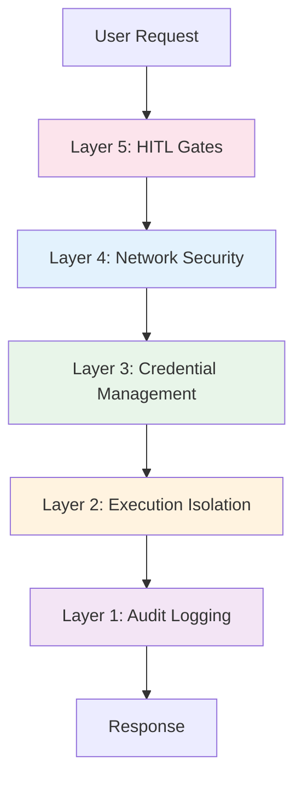

# Security Overview

Harombe implements a **defense-in-depth security architecture** specifically designed for autonomous AI agent operations.

## Security Philosophy

### Core Principles

1. **Security by Default**: All security features enabled in production
2. **Zero Trust**: Never trust, always verify
3. **Defense in Depth**: Multiple overlapping controls
4. **Fail Secure**: Default to deny on errors
5. **Complete Auditability**: Immutable trail of all security events
6. **Minimal Privilege**: Least privilege by default

## Security Layers



### Layer 1: Audit Logging

**Purpose**: Complete visibility and compliance

**Implementation**:

- SQLite database with WAL mode
- Immutable event trail
- 0.56ms average write latency
- Structured JSON context
- Configurable retention policies

**What is Logged**:

- All security decisions
- Tool invocations
- Network connections
- Credential access
- HITL approvals/denials
- Security violations

[Learn More →](../audit-logging.md)

### Layer 2: Execution Isolation

**Purpose**: Contain untrusted code execution

**Implementation**:

- Docker containers with gVisor runtime
- Syscall filtering (70 vs 300+ syscalls)
- Resource limits (CPU, memory, disk)
- Read-only root filesystem
- No network access by default
- User namespaces (non-root)

**Protection Against**:

- Arbitrary code execution
- Privilege escalation
- Host system access
- Resource exhaustion
- Kernel exploits

[Learn More →](../code-sandbox-design.md)

### Layer 3: Credential Management

**Purpose**: Secure secret storage and access

**Implementation**:

- HashiCorp Vault integration
- AppRole authentication
- Dynamic secrets
- Automatic rotation (Phase 5)
- Secret scanning (>99% detection)

**Protection Against**:

- Hardcoded secrets
- Credential theft
- Log poisoning
- Environment variable leaks
- Long-lived credentials

[Learn More →](../security-credentials.md)

### Layer 4: Network Security

**Purpose**: Control egress traffic and prevent data exfiltration

**Implementation**:

- Default-deny egress filtering
- Domain allowlisting
- Private IP blocking (RFC1918)
- DNS validation
- TLS certificate pinning (Phase 5)
- Deep packet inspection (Phase 5)

**Protection Against**:

- Data exfiltration
- Command & control (C2)
- SSRF attacks
- DNS tunneling
- Lateral movement

[Learn More →](../security-network.md)

### Layer 5: Human-in-the-Loop

**Purpose**: Human oversight for high-risk operations

**Implementation**:

- Risk-based classification
- Approval workflow
- Context-aware decisions
- Auto-approval for low-risk (Phase 5)
- 0.0001ms classification time

**Protection Against**:

- Unauthorized destructive operations
- Automated attacks
- Compromised agents
- Insider threats
- Accidental damage

[Learn More →](../hitl-design.md)

## Threat Model

### Threat Actors

1. **External Attackers**
   - Remote code execution attempts
   - Data exfiltration
   - Credential theft

2. **Malicious Insiders**
   - Privilege abuse
   - Data theft
   - Sabotage

3. **Compromised Dependencies**
   - Supply chain attacks
   - Malicious packages
   - Backdoors

4. **Autonomous Agents (Self-Threat)**
   - Unintended actions
   - Goal misalignment
   - Resource abuse

### Attack Scenarios

#### Scenario 1: Prompt Injection → Code Execution

**Attack**: Attacker crafts prompt to generate malicious code

**Mitigations**:

- ✅ Code runs in gVisor sandbox (limited syscalls)
- ✅ Network egress blocked by default
- ✅ No access to credentials
- ✅ All actions logged

**Residual Risk**: **LOW**

#### Scenario 2: Credential Theft

**Attack**: Attempt to steal API keys or tokens

**Mitigations**:

- ✅ No plaintext secrets in code/config
- ✅ Vault-based credential storage
- ✅ Secret scanning in logs (>99% detection)
- ✅ Network exfiltration blocked

**Residual Risk**: **LOW**

#### Scenario 3: Data Exfiltration

**Attack**: Compromised agent tries to exfiltrate data

**Mitigations**:

- ✅ Default-deny egress filtering
- ✅ Domain allowlist enforcement
- ✅ DNS tunneling prevention
- ✅ HITL approval for sensitive operations

**Residual Risk**: **LOW**

#### Scenario 4: Privilege Escalation

**Attack**: Escape sandbox to gain host access

**Mitigations**:

- ✅ gVisor user-space kernel
- ✅ Syscall filtering (70 safe syscalls)
- ✅ No privileged capabilities
- ✅ User namespaces (non-root)

**Residual Risk**: **VERY LOW** (requires gVisor 0-day)

## Security Metrics

### Performance

| Security Control    | Overhead | Impact   |
| ------------------- | -------- | -------- |
| Audit Logging       | 0.56ms   | Minimal  |
| Network Filtering   | <1ms     | Minimal  |
| Secret Scanning     | <1ms     | Minimal  |
| HITL Classification | 0.0001ms | None     |
| Sandbox Creation    | 2-3s     | Moderate |
| Code Execution      | 0.32ms   | Minimal  |

### Detection Rates

| Threat Type        | Detection Rate  |
| ------------------ | --------------- |
| Secret Leaks       | >99%            |
| Network Violations | 100%            |
| Sandbox Escapes    | N/A (prevented) |
| HITL Bypasses      | 100%            |

## Compliance

Harombe meets requirements for:

- **PCI DSS 4.0**: Requirements 3, 6, 8, 10
- **GDPR**: Articles 5, 17, 25, 30, 32, 33
- **SOC 2 Type II**: CC6.1, CC6.6, CC6.7, CC7.2, CC8.1
- **NIST CSF**: Identify, Protect, Detect, Respond

[Learn More →](../security-architecture.md#compliance)

## Security Checklist

Before deploying to production:

- [ ] All secrets stored in Vault
- [ ] gVisor runtime configured and tested
- [ ] Network egress allowlist configured
- [ ] Audit logging enabled with WAL mode
- [ ] Docker daemon socket mounted read-only
- [ ] Container runs as non-root user
- [ ] Resource limits configured
- [ ] TLS certificates configured
- [ ] Secret scanning enabled in CI/CD
- [ ] Vault auto-unseal configured
- [ ] Backup procedures documented
- [ ] Incident response plan prepared

## Quick Start

### Enable All Security Features

```bash
# .env
ENABLE_SANDBOXING=true
SANDBOX_RUNTIME=runsc

VAULT_ADDR=https://vault.internal:8200
VAULT_TOKEN=s.your-token

EGRESS_MODE=allowlist
ALLOWED_DOMAINS=api.anthropic.com,api.openai.com

AUDIT_DB_PATH=./data/audit.db

HITL_HIGH_RISK_TOOLS=execute_code,file_write,git_push
```

### Verify Security Configuration

```python
from harombe.security.validator import SecurityValidator

validator = SecurityValidator()
results = validator.validate_all()

for check, passed in results.items():
    status = "✅" if passed else "❌"
    print(f"{status} {check}")
```

## Security Operations

### Monitoring

Monitor these security metrics:

- Failed authentication attempts
- Secret scanner detections
- Network egress blocks
- Sandbox escape attempts
- Audit log tampering attempts
- HITL approval queue depth

### Incident Response

If a security incident is detected:

1. **Isolate**: Stop affected agent instances
2. **Investigate**: Review audit logs
3. **Contain**: Rotate compromised credentials
4. **Recover**: Restore from known-good state
5. **Learn**: Update security policies

### Security Updates

```bash
# Check for security updates
pip list --outdated

# Update dependencies
pip install --upgrade harombe

# Run security validation
pytest tests/security/test_hardening_validation.py -v
```

## Best Practices

### 1. Use gVisor in Production

```bash
# Configure Docker to use gVisor
sudo tee /etc/docker/daemon.json > /dev/null <<EOF
{
  "runtimes": {
    "runsc": {
      "path": "/usr/local/bin/runsc"
    }
  }
}
EOF

sudo systemctl restart docker
```

### 2. Rotate Secrets Regularly

```bash
# Rotate Anthropic API key
vault kv put secret/harombe/api \
  anthropic_api_key="sk-ant-new-key"

# Trigger agent restart
systemctl restart harombe
```

### 3. Review Audit Logs Daily

```bash
# Check for security violations
sqlite3 /var/lib/harombe/audit.db \
  "SELECT * FROM audit_events WHERE event_type LIKE '%violation%' ORDER BY timestamp DESC LIMIT 10;"
```

### 4. Test Security Controls

```bash
# Run security validation tests
pytest tests/security/ -v

# Run hardening validation
pytest tests/security/test_hardening_validation.py -v
```

## Next Steps

- [Security Quick Start](../security-quickstart.md) - Get started with security
- [Security Architecture](../security-architecture.md) - Deep dive
- [Production Deployment](../production-deployment-guide.md) - Deploy securely
- [Phase 5 Plan](../phases/phase5-implementation-plan.md) - Future enhancements

## Getting Help

- **Security Issues**: [security@harombe.ai](mailto:security@harombe.ai)
- **Bug Reports**: [GitHub Issues](https://github.com/smallthinkingmachines/harombe/issues)
- **Documentation**: [Full docs](https://smallthinkingmachines.github.io/harombe/)
